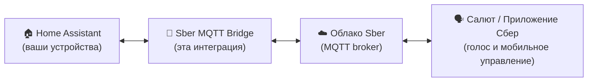

# Sber Smart Home ⟷ Home Assistant MQTT Bridge

[](https://hacs.xyz)
[](https://github.com/dzerik/sber-mqtt-bridge/releases)
[](LICENSE.txt)
[](tests/hacs/)
[](https://github.com/dzerik/sber-mqtt-bridge/actions)

**[English documentation](README_ENG.md)** | **[Документация (GitHub Pages)](https://dzerik.github.io/sber-mqtt-bridge/)**

---

> *«Салют, включи свет на кухне»* — и ваш Zigbee-выключатель, подключённый к Home Assistant, послушно выполняет команду.

Если вы собирали умный дом на Home Assistant, вы знаете это чувство: всё работает, автоматизации летают, дашборд выглядит идеально — но стоит кому-то из домашних попросить Салют выключить свет, и выясняется, что два мира ничего друг о друге не знают.

**Sber Smart Home MQTT Bridge** решает ровно эту проблему. Это нативная интеграция Home Assistant, которая делает ваши устройства HA видимыми для экосистемы Сбер — голосовых ассистентов Салют, приложения Сбер Умный дом — без отдельных серверов, аддонов или костылей. Один компонент, одна настройка через UI, и два мира начинают работать как один.

Идея простая: взять лучшее от каждой экосистемы. Home Assistant — это тысячи интеграций, гибкие автоматизации и сильное сообщество. Сбер — это голосовые ассистенты, удобное мобильное приложение и растущая линейка умных устройств. Этот мост позволяет использовать оба мира одновременно, не выбирая между ними.

## Как это работает

Интеграция устанавливает MQTT-соединение с облаком Sber, транслирует ваши HA-устройства в формат Сбер Умного дома и мгновенно синхронизирует состояния в обе стороны. Команды от Салют превращаются в вызовы HA-сервисов, а изменения в HA моментально отражаются в приложении Сбер.



## Возможности

- Нативная интеграция HA -- устанавливается через HACS, без дополнительных аддонов
- Настройка через UI -- полностью из интерфейса Home Assistant
- Массовый выбор устройств -- добавить все, по категориям, по меткам (labels), или поштучно
- Переопределение типов устройств -- смена категории Sber для каждого entity через UI или YAML
- **Связывание entity (Entity Linking)** -- привязка датчиков батареи, влажности, температуры к основному устройству: одно физическое устройство = одно устройство в Сбер
- Автоопределение связанных entity по общему `device_id` в мастере добавления
- Умная дедупликация -- если устройство имеет и `light` и `switch`, выбирается более функциональный вариант
- Синхронизация в реальном времени -- изменения в HA мгновенно видны в Сбер (debounce 100мс)
- Голосовое управление через всех ассистентов Сбер (Салют, Афина, Джой)
- **27 типов устройств** с автоматическим маппингом
- YAML-кастомизация -- sber_type, sber_name, sber_room, sber_nicknames, sber_groups, sber_features и другое
- Фильтрация по меткам (labels) -- экспорт entity по меткам HA
- Интеграция с HA Repairs -- автоматическое обнаружение проблем (отсутствующие entity, проблемы подключения)
- Сохранение переопределений -- переименования и комнаты из приложения Сбер переживают перезапуск HA
- Автоматическая повторная публикация конфигурации, когда Sber запрашивает неизвестные entity
- Валидация протокола через Pydantic -- строгая типизация JSON-сообщений Sber
- Мониторинг подключения и диагностика
- Отслеживание подтверждения устройств -- видно, какие устройства Sber подтвердил
- Автоматическое переподключение с экспоненциальной задержкой (5сек -> 5мин)
- SSL сертификат (настраивается)
- Переводы: английский и русский
- CI/CD: ruff, pytest, HACS validation, hassfest
- **498+ тестов**

## Поддерживаемые типы устройств

| Домен HA | Категория Sber | Возможности | Роли связывания |
|----------|----------------|-------------|-----------------|
| `light` | light | Вкл/выкл, яркость, цвет (HSV), цветовая температура | -- |
| `light` (LED-лента) | led_strip | LED-лента с цветом/яркостью | -- |
| `switch` | relay | Вкл/выкл | -- |
| `switch` (розетка) | socket | Вкл/выкл (иконка розетки в Сбер) | -- |
| `script` | relay | Запуск скрипта | -- |
| `button` | relay | Нажатие кнопки | -- |
| `cover` | curtain | Открыть/закрыть/стоп, позиция 0-100% | -- |
| `cover` (жалюзи) | window_blind | Открыть/закрыть/стоп, позиция 0-100% | -- |
| `climate` | hvac_ac | Вкл/выкл, температура, вентилятор, качание, режим | temperature |
| `climate` (радиатор) | hvac_radiator | Вкл/выкл, температура (25-40C) | -- |
| `climate` (обогреватель) | hvac_heater | Обогреватель | -- |
| `climate` (тёплый пол) | hvac_underfloor_heating | Тёплый пол | -- |
| `sensor` (температура) | sensor_temp | Показания температуры (точность 0.1C) | battery, signal_strength, humidity |
| `sensor` (влажность) | sensor_humidity | Показания влажности (0-100%) | battery, signal_strength, temperature |
| `binary_sensor` (движение) | sensor_pir | Обнаружение движения | battery, signal_strength |
| `binary_sensor` (дверь) | sensor_door | Состояние открыто/закрыто | battery, signal_strength |
| `binary_sensor` (протечка) | sensor_water_leak | Обнаружение протечки | battery, signal_strength |
| `binary_sensor` (дым) | sensor_smoke | Датчик дыма | battery, signal_strength |
| `binary_sensor` (газ) | sensor_gas | Датчик утечки газа | battery, signal_strength |
| `input_boolean` | scenario_button | Клик / двойной клик | -- |
| `valve` | valve | Открыть/закрыть вентиль | -- |
| `humidifier` | hvac_humidifier | Вкл/выкл, влажность, режим работы | humidity |
| `fan` | hvac_fan | Вентилятор | -- |
| `fan` (очиститель воздуха) | hvac_air_purifier | Очиститель воздуха | -- |
| `water_heater` | hvac_boiler | Бойлер/водонагреватель | -- |
| `water_heater` (чайник) | kettle | Умный чайник | -- |
| `media_player` | tv | Телевизор | -- |
| `vacuum` | vacuum_cleaner | Робот-пылесос | -- |
| -- (только через override) | intercom | Домофон | -- |

## Подготовка -- Настройка Sber Studio

Перед установкой интеграции нужно получить MQTT-учётные данные от Sber.

### Шаг 1: Регистрация в Sber Studio

1. Перейдите на [Sber Studio](https://developers.sber.ru/studio/workspaces/)
2. Войдите с вашим Sber ID (тот же аккаунт, что и в приложении Сбер Умный дом)
3. Создайте рабочее пространство, если его ещё нет

### Шаг 2: Создание проекта интеграции

1. В Sber Studio перейдите в раздел **Умный дом**
2. Нажмите **Создать проект**
3. Выберите тип **MQTT-интеграция**
4. Дайте проекту имя (например, "Home Assistant Bridge")

### Шаг 3: Получение MQTT-учётных данных

1. Откройте настройки проекта
2. Найдите раздел **MQTT-подключение**
3. Скопируйте **Логин** и **Пароль** -- они понадобятся в HA
4. Адрес брокера: `mqtt-partners.iot.sberdevices.ru`, порт: `8883`

Подробная инструкция: [Документация Sber MQTT-to-Cloud](https://developers.sber.ru/docs/ru/smarthome/mqtt-diy/mqtt-to-diy)

### Шаг 4: Привязка в приложении Сбер

1. Откройте приложение **Сбер Умный дом** на телефоне
2. Перейдите в **Настройки** > **Подключенные сервисы**
3. Ваша MQTT-интеграция должна появиться -- включите её
4. Устройства появятся в приложении после подключения моста

## Установка

### HACS (рекомендуется)

1. Откройте **HACS** в Home Assistant
2. Нажмите меню (три точки) > **Пользовательские репозитории**
3. Добавьте `https://github.com/dzerik/sber-mqtt-bridge` с категорией **Интеграция**
4. Найдите **"Sber Smart Home MQTT Bridge"** и нажмите **Установить**
5. **Перезагрузите Home Assistant**

### Ручная установка

1. Скачайте [последний релиз](https://github.com/dzerik/sber-mqtt-bridge/releases)
2. Скопируйте папку `custom_components/sber_mqtt_bridge/` в `config/custom_components/` вашего HA
3. Перезагрузите Home Assistant

## Настройка

### Первоначальная настройка

1. Перейдите в **Настройки** > **Устройства и службы** > **Добавить интеграцию**
2. Найдите **"Sber Smart Home MQTT Bridge"**
3. Введите учётные данные MQTT:

| Параметр | Обязательный | По умолчанию | Описание |
|----------|-------------|--------------|----------|
| MQTT Логин | Да | -- | Логин из проекта Sber Studio |
| MQTT Пароль | Да | -- | Пароль из проекта Sber Studio |
| MQTT Брокер | Нет | `mqtt-partners.iot.sberdevices.ru` | Адрес брокера |
| MQTT Порт | Нет | `8883` | Порт брокера (TLS) |
| Проверять SSL | Нет | `true` | Проверка сертификата брокера |

### Выбор устройств

После настройки перейдите в параметры интеграции для выбора устройств. Доступны пять режимов:

| Режим | Описание |
|-------|----------|
| **Выбрать вручную** | Выбрать отдельные устройства из списка с поиском. Здесь же можно удалять. |
| **Добавить по категории** | Выбрать категории (Свет, Переключатели и т.д.) с количеством устройств. Добавляет все устройства из выбранных категорий. Существующий выбор сохраняется. |
| **Добавить по метке** | Выбрать метки (labels) HA для экспорта всех entity с этими метками. |
| **Добавить ВСЕ** | Один клик: добавить все поддерживаемые устройства в Sber. |
| **Удалить ВСЕ** | Очистить весь список. |

**Переопределение типов устройств**: В меню Параметры можно переопределить категорию Sber для любого entity. Например, изменить `switch` с `relay` на `socket`, чтобы он отображался как умная розетка в приложении Сбер.

**Умная дедупликация**: Если Zigbee-устройство регистрирует и `light.кухня` и `switch.кухня`, включается только `light` (более богатый API с яркостью/цветом). Приоритет: light > cover > climate > humidifier > valve > sensor > switch > script > button.

### YAML-кастомизация

Вы можете точно настроить отображение entity в Sber через `configuration.yaml`:

```yaml
sber_mqtt_bridge:
  entity_config:
    light.kitchen:
      sber_type: light           # Переопределить категорию Sber
      sber_name: "Свет на кухне" # Имя в приложении Сбер
      sber_room: "Кухня"         # Назначение комнаты
      sber_nicknames:            # Альтернативные имена для голосового управления
        - "основной свет"
        - "потолочный свет"
      sber_groups:               # Группы устройств
        - "kitchen_lights"
      sber_features_add:         # Добавить возможности Sber
        - "colour_setting"
      sber_features_remove:      # Убрать возможности Sber
        - "colour_temp"
      sber_partner_meta: {}      # Пользовательские метаданные партнёра
      sber_parent_id: "light.living_room"  # ID родительского устройства
```

| Параметр | Описание |
|----------|----------|
| `sber_type` | Переопределить автоматически определённую категорию Sber (например, `relay` -> `socket`) |
| `sber_name` | Пользовательское имя устройства в приложении Сбер и для голосовых команд |
| `sber_room` | Комната в Sber (переопределяет назначение из приложения) |
| `sber_nicknames` | Альтернативные имена для голосового управления |
| `sber_groups` | ID групп для объединения устройств в Sber |
| `sber_features_add` | Дополнительные возможности Sber для публикации |
| `sber_features_remove` | Возможности Sber для отключения |
| `sber_partner_meta` | Пользовательские метаданные, передаваемые в Sber |
| `sber_parent_id` | Entity ID родительского устройства для иерархической группировки |

### Связывание entity (Entity Linking)

Связывание entity позволяет привязать вспомогательные HA-сущности (датчик батареи, уровень сигнала, влажность, температура) к основному устройству Sber. Это отражает физическую реальность: один Zigbee-датчик создаёт несколько entity в HA, но должен выглядеть как одно устройство в приложении Сбер.

**Без связывания**: датчик протечки с датчиком батареи создаёт два отдельных устройства Sber.
**Со связыванием**: уровень заряда батареи автоматически включается в состояние датчика протечки — одно устройство, полные данные.

#### Поддерживаемые роли по категории Sber

| Категория Sber | Доступные роли |
|----------------|----------------|
| sensor_water_leak | battery, signal_strength |
| sensor_pir | battery, signal_strength |
| sensor_door | battery, signal_strength |
| sensor_temp | battery, signal_strength, humidity |
| sensor_humidity | battery, signal_strength, temperature |
| hvac_ac | temperature |
| hvac_humidifier | humidity |

#### Процесс в мастере добавления

1. Выберите тип устройства и основную entity.
2. Мастер автоматически определяет связанные entity, разделяющие один `device_id` в HA.
3. Совместимые entity предвыбраны (отображаются зелёными). Несовместимые отображаются серым с пометкой "(not supported)".
4. Укажите имя и подтвердите.
5. Привязанные entity исчезают из списка доступных entity — ими управляет основное устройство.

Данные привязанных entity (уровень батареи, уровень сигнала и т.д.) включаются в каждую публикацию состояния основного устройства в Sber. Изменение состояния привязанной entity вызывает немедленную повторную публикацию состояния основного устройства.

### Управление устройствами в приложении Сбер

После добавления устройств:

1. Откройте приложение **Сбер Умный дом**
2. Устройства появятся автоматически (может занять 10-30 секунд)
3. **Переименовать устройство**: нажмите на устройство > иконка настроек > измените имя
4. **Назначить комнату**: нажмите на устройство > иконка настроек > выберите комнату
5. **Голосовое управление**: скажите *"Салют, включи свет на кухне"*

**Примеры голосовых команд:**
- *"Салют, включи свет в гостиной"*
- *"Салют, выключи все розетки"*
- *"Салют, какая температура в спальне?"*
- *"Салют, закрой шторы"*
- *"Салют, установи температуру 23 градуса"*
- *"Салют, включи увлажнитель"*

**Примечание**: Переименования и назначения комнат, сделанные в приложении Сбер, сохраняются локально в интеграции и будут включены в будущие публикации конфигурации. Эти данные сохраняются при перезапуске HA.

## Устранение неполадок

| Проблема | Решение |
|----------|---------|
| Не удаётся подключиться | Проверьте учётные данные в Sber Studio. Убедитесь, что проект активен. |
| Ошибки SSL | Попробуйте отключить "Проверять SSL" в настройках интеграции (для нестандартных CA). |
| Устройства не появляются в Сбер | Проверьте Параметры > выберите устройства. Проверьте логи HA на предупреждения маппинга. |
| Устройства появляются и исчезают | Проверьте логи HA на сообщения о переподключении. Убедитесь в стабильности интернета. |
| Дублирование устройств | Удалите дубли в Параметры > ручной режим. Или "Удалить ВСЕ", затем "Добавить ВСЕ" для чистого сброса. |
| Датчики показывают неверные значения | Включите отладочные логи и проверьте маппинг entity в логах. |
| Пропавшие entity или проблемы подключения | Проверьте **Настройки > Ремонт** -- интеграция автоматически создаёт уведомления о типичных проблемах. |

### HA Repairs (Ремонт)

Интеграция использует систему Repairs в Home Assistant для уведомления о проблемах. Перейдите в **Настройки** > **Ремонт** для просмотра активных проблем:
- Отсутствующие entity, которые были ранее экспортированы
- Ошибки подключения MQTT
- Проблемы конфигурации

### Отладочные логи

Добавьте в `configuration.yaml`:

```yaml
logger:
  logs:
    custom_components.sber_mqtt_bridge: debug
```

Увидите:
- `MQTT <- topic (N bytes)` -- каждое входящее MQTT сообщение
- `Sber -> HA command: entity_id [ключи]` -- детали команды
- `HA -> Sber state: entity_id = состояние` -- публикация состояний
- `Entity xxx -> Sber категория (домен, device_class)` -- решения маппинга
- `Sber error (#N): {...}` -- ошибки от облака Sber

### Диагностика

Перейдите в **Настройки** > **Устройства и службы** > **Sber Smart Home MQTT Bridge** > **три точки** > **Скачать диагностику**. Файл содержит:
- Статус подключения и время работы
- Счётчики сообщений (получено, отправлено, ошибки)
- Список подтверждённых/неподтверждённых устройств
- Конфигурацию устройств

## Благодарности

Этот проект является форком и развитием [MQTT-SberGate](https://gitverse.ru/mberezovsky/MQTT-SberGate) от [@mberezovsky](https://gitverse.ru/mberezovsky). Оригинальный проект предоставил реализацию MQTT-протокола Sber Smart Home в виде аддона Home Assistant. Эта версия переписана как нативная HACS-интеграция с полной асинхронной поддержкой, Config Flow UI и комплексным покрытием тестами.

Спасибо оригинальному автору за базовую работу и реверс-инжиниринг протокола Sber.

## Торговые марки и правовая информация

Все названия продуктов, логотипы и бренды, упомянутые в этом проекте, являются собственностью их владельцев:

- **Сбер**, **SberDevices**, **Салют**, **Сбер Умный дом** -- торговые марки [Сбер](https://www.sber.ru/) (ПАО Сбербанк).
- **Home Assistant** -- торговая марка проекта [Home Assistant](https://www.home-assistant.io/).
- **HACS** (Home Assistant Community Store) -- независимый проект сообщества.

Этот проект не связан, не одобрен и не спонсирован Сбером, SberDevices или проектом Home Assistant. Это независимая интеграция с открытым исходным кодом.

## Ссылки

- [Документация проекта (GitHub Pages)](https://dzerik.github.io/sber-mqtt-bridge/)
- [API Reference](https://dzerik.github.io/sber-mqtt-bridge/api/)
- [Портал разработчиков Sber Smart Home](https://developers.sber.ru/docs/ru/smarthome)
- [Регистрация в Sber Studio](https://developers.sber.ru/docs/ru/smarthome/space/registration)
- [Руководство MQTT-to-Cloud](https://developers.sber.ru/docs/ru/smarthome/mqtt-diy/mqtt-to-diy)
- [Поддерживаемые категории устройств](https://developers.sber.ru/docs/ru/smarthome/c2c/devices)

## Участие в разработке

Смотрите [CONTRIBUTING.md](CONTRIBUTING.md) для настройки среды разработки и рекомендаций.

## Лицензия

[MIT](LICENSE.txt)
