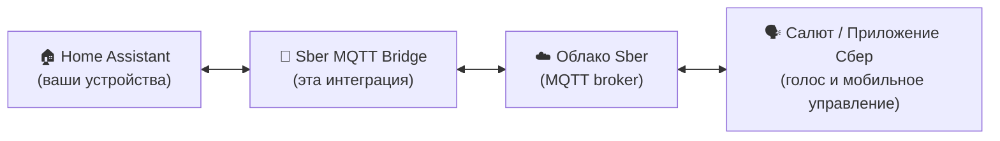

# Sber Smart Home ⟷ Home Assistant MQTT Bridge

[](https://hacs.xyz)
[](https://github.com/dzerik/sber-mqtt-bridge/releases)
[](LICENSE.txt)
[](tests/hacs/)
[](https://github.com/dzerik/sber-mqtt-bridge/actions/workflows/ci.yaml)
[](https://github.com/dzerik/sber-mqtt-bridge/actions/workflows/hacs.yml)
[](https://github.com/dzerik/sber-mqtt-bridge/actions/workflows/hassfest.yml)
[](https://github.com/dzerik/sber-mqtt-bridge/releases)

**[English documentation](README_ENG.md)** | **[Документация (GitHub Pages)](https://dzerik.github.io/sber-mqtt-bridge/)**

> [!IMPORTANT]
> **🧪 PUBLIC TESTING — Ищем тестеров!**
>
> Проект перешёл в стадию **публичного тестирования**. Базовая функциональность стабильна,
> но разнообразие реальных устройств Home Assistant огромно, и нам нужна ваша помощь,
> чтобы выявить edge-cases и довести маппинг до ума.
>
> **Как помочь:**
> - Установите интеграцию через HACS и подключите ваши устройства к Сбер
> - Поделитесь опытом в [Tester Feedback](https://github.com/dzerik/sber-mqtt-bridge/issues/new?template=tester_feedback.yml) —
>   что работает, что нет, какие модели устройств вы пробовали
> - Явные баги — в [Bug Report](https://github.com/dzerik/sber-mqtt-bridge/issues/new?template=bug_report.yml)
>
> API и конфигурация ещё могут меняться до релиза `2.0.0`. Спасибо всем, кто тестирует!

---

> *«Салют, включи свет на кухне»* — и ваш Zigbee-выключатель, подключённый к Home Assistant, послушно выполняет команду.

Если вы собирали умный дом на Home Assistant, вы знаете это чувство: всё работает, автоматизации летают, дашборд выглядит идеально — но стоит кому-то из домашних попросить Салют выключить свет, и выясняется, что два мира ничего друг о друге не знают.

**Sber Smart Home MQTT Bridge** решает ровно эту проблему. Это нативная интеграция Home Assistant, которая делает ваши устройства HA видимыми для экосистемы Сбер — голосовых ассистентов Салют, приложения Сбер Умный дом — без отдельных серверов, аддонов или костылей. Один компонент, одна настройка через UI, и два мира начинают работать как один.

Идея простая: взять лучшее от каждой экосистемы. Home Assistant — это тысячи интеграций, гибкие автоматизации и сильное сообщество. Сбер — это голосовые ассистенты, удобное мобильное приложение и растущая линейка умных устройств. Этот мост позволяет использовать оба мира одновременно, не выбирая между ними.

## Как это работает

Интеграция устанавливает MQTT-соединение с облаком Sber, транслирует ваши HA-устройства в формат Сбер Умного дома и мгновенно синхронизирует состояния в обе стороны. Команды от Салют превращаются в вызовы HA-сервисов, а изменения в HA моментально отражаются в приложении Сбер.


```mermaid
flowchart LR
    HA["🏠 Home Assistant\n(ваши устройства)"]
    Bridge["🔌 Sber MQTT Bridge\n(эта интеграция)"]
    Cloud["☁️ Облако Sber\n(MQTT broker)"]
    App["🗣️ Салют / Приложение Сбер\n(голос и мобильное управление)"]

    HA <--> Bridge <--> Cloud <--> App
```

### Как обновляются данные

Мост ничего не опрашивает — все обновления приходят push-сообщениями:

- **Home Assistant → Сбер.** Мост подписан на изменения состояний экспортируемых сущностей и
  отправляет новое состояние в Сбер сразу, объединяя изменения в пределах короткого окна
  (`debounce_delay`, по умолчанию 0,1 с). После команды из Сбера состояние отправляется ещё раз
  через `confirm_delay` (1,5 с), чтобы в приложение попали атрибуты, которые HA обновляет с
  задержкой.
- **Сбер → Home Assistant.** Команды и запросы состояния приходят из облака Сбера по MQTT и сразу
  превращаются в вызовы служб Home Assistant или ответы.
- **Список устройств** отправляется в Сбер при подключении, при изменении набора или настроек
  устройств и по запросу облака — с ожиданием загрузки устройств (см. «Тайминги синхронизации
  устройств»).
- **Диагностические сущности моста** обновляются по уведомлениям самого моста: частые изменения
  объединяются (не больше одной записи в 5 секунд на сущность), а смена фазы подключения и потеря
  связи показываются сразу.
- **Связь с брокером** держится постоянно; после обрыва мост переподключается с растущей паузой
  от 5 секунд до 5 минут (`reconnect_interval_min` / `reconnect_interval_max`).

## Возможности

- Нативная интеграция HA -- устанавливается через HACS, без дополнительных аддонов
- Настройка через UI -- полностью из интерфейса Home Assistant
- Массовый выбор устройств -- добавить все, по категориям, по меткам (labels), или поштучно
- Переопределение типов устройств -- смена категории Sber для каждого entity через UI или YAML
- **Связывание entity (Entity Linking)** -- привязка датчиков батареи, влажности, температуры к основному устройству: одно физическое устройство = одно устройство в Сбер
- Автоопределение связанных entity по общему `device_id` в мастере добавления
- Умная дедупликация -- если устройство имеет и `light` и `switch`, выбирается более функциональный вариант
- Синхронизация в реальном времени -- изменения в HA мгновенно видны в Сбер (debounce 100мс)
- Голосовое управление через всех ассистентов Сбер (Салют, Афина, Джой)
- **28 категорий Sber (27 типов устройств + hub)** с автоматическим маппингом
- YAML-кастомизация -- sber_type, sber_name, sber_room, sber_nicknames, sber_groups, sber_features и другое
- Фильтрация по меткам (labels) -- экспорт entity по меткам HA
- Интеграция с HA Repairs -- автоматическое обнаружение проблем (отсутствующие entity, проблемы подключения)
- Сохранение переопределений -- переименования и комнаты из приложения Сбер переживают перезапуск HA
- Автоматическая повторная публикация конфигурации, когда Sber запрашивает неизвестные entity
- Валидация протокола через Pydantic -- строгая типизация JSON-сообщений Sber
- **Автоматическое обнаружение дрейфа спецификации Sber** -- еженедельный CI-scraper тянет каноничные схемы с `developers.sber.ru`, сравнивает с нашими моделями и открывает PR при расхождениях (см. `tools/fetch_sber_schemas.py`, `tools/codegen.py`)
- **Runtime-валидация типов features** -- сгенерированный из документации Sber словарь `FEATURE_TYPES` ловит несоответствия (напр. PIR как BOOL вместо ENUM) до отправки в облако
- **Валидация обязательных features (✔︎ markers)** -- `CATEGORY_OBLIGATORY_FEATURES` автоматически собирается из таблицы "Доступные функции устройства" Sber и гарантирует, что устройство эмитит полный набор обязательных функций (напр. `valve` без `open_percentage` ловится до публикации)
- Мониторинг подключения и диагностика
- Отслеживание подтверждения устройств -- видно, какие устройства Sber подтвердил
- Автоматическое переподключение с экспоненциальной задержкой (5сек -> 5мин)
- SSL сертификат (настраивается)
- Переводы: английский и русский
- CI/CD: ruff, pytest, HACS validation, hassfest, Sber spec drift detection
- **1760+ тестов**

## Детали реализации

### Типизированные константы (sber_constants.py)

Модуль `sber_constants.py` содержит строго типизированные `StrEnum`-константы для всего протокола Sber:
- **SberFeature** — 74 ключа признаков устройств (все feature-имена протокола)
- **SberValueType** — типы значений (`BOOL`, `INTEGER`, `ENUM`, `COLOUR`, `FLOAT`)
- **HAState** — состояния Home Assistant (`on`, `off`, `open`, `closed` и др.)
- **MqttTopicSuffix** — суффиксы MQTT-топиков

### Pydantic-хелперы для значений

Функции-фабрики для формирования значений протокола Sber:
- `make_state()` — создание структуры состояния
- `make_bool_value()` — булево значение
- `make_integer_value()` — целочисленное значение (возвращает строку согласно спецификации Sber)
- `make_enum_value()` — enum-значение
- `make_colour_value()` — цветовое значение HSV

### HA Context propagation

Команды от Sber передаются в Home Assistant с заполненным `Context`, что обеспечивает корректную атрибуцию в журнале (logbook). В логах HA видно, что команда пришла именно от Sber-интеграции.

### Value change diffing

Метод `has_significant_change()` сравнивает новое состояние со старым перед каждой публикацией. Это исключает лишние MQTT publish при незначительных изменениях (например, при поллинге HA без реального изменения значения).

### Online status logic

Логика онлайн-статуса дифференцирована по типу сенсора:
- **Event-based** binary_sensors (движение, дверь, протечка): `unknown` = **online** (датчик ждёт события)
- **Value-based** сенсоры (температура, влажность): `unknown` = **offline** (нет данных = нет связи)
- Значок **"Loading..."** в панели означает, что HA ещё не получил ни одного состояния от entity

## Поддерживаемые типы устройств

| Домен HA | Категория Sber | Возможности | Роли связывания |
|----------|----------------|-------------|-----------------|
| `light` | light | Вкл/выкл, яркость, цвет (HSV), цветовая температура | -- |
| `light` (LED-лента) | led_strip | LED-лента с цветом/яркостью | -- |
| `switch` | relay | Вкл/выкл | -- |
| `switch` (розетка) | socket | Вкл/выкл (иконка розетки в Сбер) | -- |
| `script` | relay | Запуск скрипта | -- |
| `button` | relay | Нажатие кнопки | -- |
| `cover` | curtain | Открыть/закрыть/стоп, позиция 0-100% | -- |
| `cover` (жалюзи) | window_blind | Открыть/закрыть/стоп, позиция 0-100% | -- |
| `climate` | hvac_ac | Вкл/выкл, температура, вентилятор, качание, режим | temperature |
| `climate` (радиатор) | hvac_radiator | Вкл/выкл, температура (25-40C) | -- |
| `climate` (обогреватель) | hvac_heater | Обогреватель | -- |
| `climate` (тёплый пол) | hvac_underfloor_heating | Тёплый пол | -- |
| `sensor` (температура) | sensor_temp | Показания температуры (точность 0.1C) | battery, signal_strength, humidity |
| `sensor` (влажность) | sensor_humidity | Показания влажности (0-100%) | battery, signal_strength, temperature |
| `binary_sensor` (движение) | sensor_pir | Обнаружение движения | battery, signal_strength |
| `binary_sensor` (дверь) | sensor_door | Состояние открыто/закрыто | battery, signal_strength |
| `binary_sensor` (протечка) | sensor_water_leak | Обнаружение протечки | battery, signal_strength |
| `binary_sensor` (дым) | sensor_smoke | Датчик дыма | battery, signal_strength |
| `binary_sensor` (газ) | sensor_gas | Датчик утечки газа | battery, signal_strength |
| `input_boolean` | scenario_button | Клик / двойной клик | -- |
| `event` (кнопки Zigbee) | scenario_button | Клик / двойной клик / долгое нажатие | -- |
| `valve` | valve | Открыть/закрыть вентиль | -- |
| `humidifier` | hvac_humidifier | Вкл/выкл, влажность, режим работы | humidity |
| `fan` | hvac_fan | Вентилятор | -- |
| `fan` (очиститель воздуха) | hvac_air_purifier | Очиститель воздуха | -- |
| `water_heater` | hvac_boiler | Бойлер/водонагреватель | -- |
| `water_heater` (чайник) | kettle | Умный чайник | -- |
| `media_player` | tv | Телевизор | -- |
| `vacuum` | vacuum_cleaner | Робот-пылесос | -- |
| -- (только через override) | intercom | Домофон | -- |

> [!IMPORTANT]
> **Протестировано на реальном оборудовании: 12 из 28 категорий** (light, climate, curtain, valve, fan, sensor_pir, sensor_temp, sensor_water_leak, humidifier, tv, scenario_button, hub).
> 16 категорий ещё не проверены на физических устройствах -- нужна помощь сообщества!
>
> **[Полный статус тестирования устройств](https://dzerik.github.io/sber-mqtt-bridge/devices/#статус-тестирования-на-реальном-оборудовании)**

## Подготовка -- Настройка Sber Studio

Перед установкой интеграции нужно получить MQTT-учётные данные от Sber.

### Шаг 1: Регистрация в Sber Studio

1. Перейдите на [Sber Studio](https://developers.sber.ru/studio/workspaces/)
2. Войдите с вашим Sber ID (тот же аккаунт, что и в приложении Сбер Умный дом)
3. Создайте рабочее пространство, если его ещё нет

### Шаг 2: Создание проекта интеграции

1. В Sber Studio перейдите в раздел **Умный дом**
2. Нажмите **Создать проект**
3. Выберите тип **MQTT-интеграция**
4. Дайте проекту имя (например, "Home Assistant Bridge")

### Шаг 3: Получение MQTT-учётных данных

1. Откройте настройки проекта
2. Найдите раздел **MQTT-подключение**
3. Скопируйте **Логин** и **Пароль** -- они понадобятся в HA
4. Адрес брокера: `mqtt-partners.iot.sberdevices.ru`, порт: `8883`

Подробная инструкция: [Документация Sber MQTT-to-Cloud](https://developers.sber.ru/docs/ru/smarthome/mqtt-diy/mqtt-to-diy)

### Шаг 4: Привязка в приложении Сбер

1. Откройте приложение **Сбер Умный дом**  или **Салют** на телефоне
2. Перейдите в **Профиль** > **Дом от интегратора** > Ввести пароль из шага 3
3. Ваша MQTT-интеграция должна появиться -- включите её
4. Устройства появятся в приложении после подключения моста

## Установка

### HACS (рекомендуется)

[](https://my.home-assistant.io/redirect/hacs_repository/?owner=dzerik&repository=sber-mqtt-bridge&category=integration)

Нажмите кнопку выше — HACS откроется на странице репозитория, останется только нажать **Download**.

Или вручную:

1. Откройте **HACS** в Home Assistant
2. Нажмите меню (три точки) > **Пользовательские репозитории**
3. Добавьте `https://github.com/dzerik/sber-mqtt-bridge` с категорией **Интеграция**
4. Найдите **"Sber Smart Home MQTT Bridge"** и нажмите **Установить**
5. **Перезагрузите Home Assistant**

### Ручная установка

1. Скачайте [последний релиз](https://github.com/dzerik/sber-mqtt-bridge/releases)
2. Скопируйте папку `custom_components/sber_mqtt_bridge/` в `config/custom_components/` вашего HA
3. Перезагрузите Home Assistant

## Настройка

### Первоначальная настройка

1. Перейдите в **Настройки** > **Устройства и службы** > **Добавить интеграцию**
2. Найдите **"Sber Smart Home MQTT Bridge"**
3. Введите учётные данные MQTT:

| Параметр | Обязательный | По умолчанию | Описание |
|----------|-------------|--------------|----------|
| MQTT Логин | Да | -- | Логин из проекта Sber Studio |
| MQTT Пароль | Да | -- | Пароль из проекта Sber Studio |
| MQTT Брокер | Нет | `mqtt-partners.iot.sberdevices.ru` | Адрес брокера |
| MQTT Порт | Нет | `8883` | Порт брокера (TLS) |
| Проверять SSL | Нет | `true` | Проверка сертификата брокера |

### Параметры интеграции (кнопка «Настроить»)

Основное управление устройствами — в панели **Sber Bridge** в боковом меню. Окно параметров
интеграции — запасной путь без панели: **Настройки** > **Устройства и службы** >
**Sber Smart Home MQTT Bridge** > **Настроить**.

На первом экране поле «Что вы хотите сделать?»:

| Действие | Что происходит |
|----------|----------------|
| **Entity type preview (N)** | Список экспортируемых сущностей, сгруппированных по категориям Sber; ✏️ — тип задан вручную. Ничего не меняет |
| **Open Sber Bridge panel (recommended)** | Закрывает окно без изменений — дальше работайте в панели |
| **Advanced entity management (fallback)** | Открывает меню «Расширенные настройки» из трёх разделов, описанных ниже |

#### Выбор сущностей

| Режим | Что делает |
|-------|------------|
| **Select entities manually** | Список с поиском: отмеченные сущности экспортируются, снятые — убираются из Сбера |
| **Add all entities by domain** | Добавляет включённые сущности выбранных доменов HA к уже выбранным. От одного устройства HA берётся одна сущность — та, которой Сбер управляет полнее всего (см. «Умная дедупликация») |
| **Add entities by label** | Добавляет к уже выбранным все поддерживаемые сущности, у которых есть хотя бы одна из выбранных меток HA |
| **Add ALL supported entities** | **Заменяет** список всеми поддерживаемыми сущностями (с дедупликацией по устройствам) |
| **Remove ALL entities** | Очищает список: мост отправляет в Сбер конфигурацию без устройств, и они пропадают из приложения |

**Умная дедупликация** (только в режимах «по доменам» и «ВСЕ»): если устройство HA
регистрирует несколько сущностей, например `light.кухня` и `switch.кухня`, добавляется одна —
с наивысшим приоритетом домена: light > cover > climate > water_heater > humidifier > vacuum >
media_player > fan > valve > lock > switch > script > button, input_boolean, event > binary_sensor >
sensor. Сущности без устройства HA добавляются всегда.

#### Переопределение типов устройств

Для каждой экспортируемой сущности — выпадающий список категорий Sber. **Auto** (по умолчанию) —
категория определяется по домену и `device_class`. Меняйте, если автоматика ошиблась: например,
`switch` с лампой → `light`, или реле → `socket`, чтобы в приложении была иконка розетки. Если ни
одна сущность ещё не выбрана, раздел сообщает об этом и закрывается.

#### Тайминги синхронизации устройств

Сбер считает каждую публикацию конфигурации **полным** списком устройств: устройство, которого в
ней нет, облако удаляет, а когда оно появляется снова — заводит заново в комнате хаба. Поэтому при
запуске и после изменений мост ждёт, пока устройства получат состояние.

| Параметр | По умолчанию | Диапазон | Назначение |
|----------|:------------:|:--------:|------------|
| **Окно затишья, с** (`config_settle_delay`) | `5` | 0–300 | Пока устройства ещё загружаются, список публикуется, когда столько секунд подряд не появилось ни одного нового. Если все устройства уже загружены, список уходит сразу. Увеличьте, если после перезапуска HA устройства переезжают в комнату хаба — например, батарейные Zigbee-датчики просыпаются медленно |
| **Максимальное ожидание устройств, с** (`config_max_wait`) | `120` | 1–900 | Верхняя граница ожидания: по её истечении список публикуется без не загрузившихся устройств, а в журнал пишется предупреждение с их именами. Увеличьте для большой Zigbee/Z-Wave-сети, уменьшите, если сущность, которая никогда не загрузится, задерживает публикацию остальных |

Ожидание держат только устройства, которые Сбер уже знает: новое устройство, ещё не загрузившееся,
просто появится в одной из следующих публикаций. Оба параметра дублируются на вкладке **Настройки**
панели и применяются без перезапуска интеграции.

### Параметры моста (вкладка «Настройки» панели)

Панель **Sber Bridge** > вкладка **Настройки**. Значения сохраняются кнопкой **Сохранить**
и применяются к работающему мосту без перезапуска интеграции; **Reset to Defaults** подставляет
значения по умолчанию (их тоже нужно сохранить). Значение вне диапазона отклоняется целиком — ни
один параметр из запроса не сохраняется.

| Параметр | По умолчанию | Диапазон | Назначение и когда менять |
|----------|:------------:|:--------:|---------------------------|
| **Мин. интервал переподключения, с** (`reconnect_interval_min`) | `5` | 1–3600 | Пауза перед первой повторной попыткой после обрыва связи; каждая неудачная попытка удваивает паузу. К этому значению пауза возвращается после сессии, продержавшейся 60 секунд. Увеличьте, если брокер отвергает слишком частые подключения |
| **Макс. интервал переподключения, с** (`reconnect_interval_max`) | `300` | 1–86400 | Потолок, до которого растёт пауза между попытками. Уменьшите, чтобы после долгого отсутствия интернета мост возвращался быстрее. Задавайте не меньше минимального интервала |
| **Проверять SSL-сертификат** (`sber_verify_ssl`) | включено | вкл/выкл | Проверка TLS-сертификата брокера. Выключайте только если брокер использует собственный или самоподписанный сертификат. Применяется при следующем подключении |
| **Задержка перед отправкой состояния, с** (`debounce_delay`) | `0.1` | 0–60 | Изменения состояний, пришедшие в пределах этого окна, отправляются в Сбер одним сообщением; при непрерывном потоке изменений отправка всё равно происходит не реже, чем раз в пять таких окон. `0` — отправлять сразу. Увеличьте, если устройства шлют много мелких обновлений подряд |
| **Макс. размер пакета MQTT, байт** (`max_mqtt_payload_size`) | `1000000` | 1024–10000000 | Входящие сообщения от Сбера крупнее этого размера отбрасываются с предупреждением в журнале — защита от переполнения памяти. Менять обычно не нужно |
| **Пауза перед отправкой конфигурации, с** (`config_settle_delay`) | `5` | 0–300 | То же, что «Окно затишья» в параметрах интеграции (см. выше) |
| **Макс. ожидание загрузки устройств, с** (`config_max_wait`) | `120` | 1–900 | То же, что «Максимальное ожидание устройств» (см. выше) |
| **Отложенное подтверждение состояния, с** (`confirm_delay`) | `1.5` | 0–60 | Через столько секунд после команды из Сбера мост ещё раз отправляет состояние устройства — чтобы в приложении оказались атрибуты, которые HA обновляет с задержкой. Увеличьте для медленных устройств, у которых после команды в приложении остаётся старое значение |
| **Задержка проверки на молчаливое отклонение, с** (`ack_audit_delay`) | `60` | 1–3600 | Через столько секунд после публикации конфигурации мост проверяет, какие устройства Сбер так и не подтвердил, и пишет предупреждение в журнал. Новое значение действует для проверок, запланированных после сохранения |
| **Размер журнала сообщений MQTT** (`message_log_size`) | `50` | 1–10000 | Сколько последних записей хранят журналы вкладки «Инструменты» (сообщения MQTT, трассировки, изменения состояний, ошибки проверки, подтверждения команд). Увеличьте на время отладки: записи хранятся в памяти |
| **Назначать parent_id автоматически** (`hub_auto_parent_id`, карточка «Устройство-хаб») | выключено | вкл/выкл | Всем устройствам без явного `parent_id` проставляется `parent_id: root` — они становятся дочерними устройствами хаба моста. Применяется при следующей публикации конфигурации |
| **Добавлять метку ha_serial_number** (`ha_serial_number_enabled`) | выключено | вкл/выкл | Добавляет в `partner_meta.ha_serial_number` каждого устройства серийный номер или MAC из реестра устройств HA, а без них — метку этого экземпляра HA (`ha-<8 символов>`). Включайте, если пользуетесь интеграцией, которая импортирует устройства Сбера обратно в HA: по метке она распознаёт петлю. Применяется при следующей публикации конфигурации |
| **Показывать уведомление о молчаливом отклонении** (`silent_rejection_alerts`) | выключено | вкл/выкл | Устройства, которые Сбер ни разу не подтвердил, показываются уведомлением в **Настройки** > **Ремонт**. По умолчанию выключено: Сбер может часами не запрашивать состояние принятого устройства, и уведомление было бы ложным. Данные проверки в любом случае видны в панели и в журнале |

### Настройки отдельных устройств

Открываются кликом по устройству в таблице панели. Сохраняются для конкретной сущности и
применяются без перезапуска интеграции.

**Импульсные ворота** (категория `gate`, реле `switch` / `button` / `script` со связанным датчиком
положения):

| Параметр | По умолчанию | Диапазон | Назначение |
|----------|:------------:|:--------:|------------|
| **Инвертировать геркон** (`invert_contact`) | выключено | вкл/выкл | Включите, если связанный датчик показывает `on` при закрытых воротах |
| **Сервис импульса** (`impulse_service`) | `auto` | `auto`, `toggle`, `turn_on` | Только для реле `switch`: `auto` и `toggle` вызывают `switch.toggle`, `turn_on` — `switch.turn_on`. Для `button` всегда вызывается `press`, для `script` — `turn_on` |
| **Время хода створки, с** (`travel_time`) | `0` | 0–600 | `0` — выключено: положение меняется только по датчику. Со значением ворота сразу после импульса сообщают «открываются» / «закрываются»; всё это время приложение Сбера блокирует кнопку управления |
| **Автозакрытие через, с** (`auto_close_time`) | `0` | 0–3600 | Укажите ту же задержку, через которую плата ворот сама закрывает створку. `0` — выключено. По истечении ворота сообщают «закрываются», пока датчик не скажет иное. Задайте заодно время хода: без него «закрываются» держится 30 секунд |

**Чайник** (категория `kettle`, `water_heater` с режимами работы):

| Параметр | По умолчанию | Допустимые значения | Назначение |
|----------|:------------:|:-------------------:|------------|
| **Режим «выключено»** (`off_mode`) | автоопределение (`off`) | режим из `operation_list` сущности | Режим HA, которым мост выключает чайник |
| **Режим «кипячение»** (`boil_mode`) | автоопределение (`boil`) | режим из `operation_list` | Режим HA для кипячения |
| **Режим «нагрев до температуры»** (`heat_mode`) | автоопределение (`heat`, `electric`, `eco`, `gas`, `heat_pump`, `high_demand`, `performance` — первый найденный) | режим из `operation_list` | Режим HA для нагрева до заданной температуры |

Меняйте режимы, если автоопределение не нашло нужный (панель показывает, какой режим сейчас
используется). Если режим не найден или чайник не сообщает режимов, мост просто включает и
выключает его.

**Датчик температуры** (категория `sensor_temp`): параметр `temp_unit_view` (по умолчанию `true`)
решает, публиковать ли функцию `temp_unit_view` — шкалу отображения температуры. Отдельного поля в
панели нет: нажмите **Экспорт** на панели инструментов, в файле задайте
`"gate_options": {"sensor.<имя>": {"temp_unit_view": false}}` (блок `gate_options` хранит настройки
всех устройств, не только ворот) и загрузите файл через **Импорт**. Выключайте, только если нужен
минимальный набор функций: изменение набора функций заставляет Сбер зарегистрировать устройство
заново, и оно теряет комнату.

### YAML-кастомизация

Вы можете точно настроить отображение entity в Sber через `configuration.yaml`:

```yaml
sber_mqtt_bridge:
  entity_config:
    light.kitchen:
      sber_type: light           # Переопределить категорию Sber
      sber_name: "Свет на кухне" # Имя в приложении Сбер
      sber_room: "Кухня"         # Назначение комнаты
      sber_nicknames:            # Альтернативные имена для голосового управления
        - "основной свет"
        - "потолочный свет"
      sber_groups:               # Группы устройств
        - "kitchen_lights"
      sber_features_add:         # Добавить возможности Sber
        - "colour_setting"
      sber_features_remove:      # Убрать возможности Sber
        - "colour_temp"
      sber_partner_meta: {}      # Пользовательские метаданные партнёра
      sber_parent_id: "light.living_room"  # ID родительского устройства
```

| Параметр | Описание |
|----------|----------|
| `sber_type` | Переопределить автоматически определённую категорию Sber (например, `relay` -> `socket`) |
| `sber_name` | Пользовательское имя устройства в приложении Сбер и для голосовых команд |
| `sber_room` | Комната в Sber (переопределяет назначение из приложения) |
| `sber_nicknames` | Альтернативные имена для голосового управления |
| `sber_groups` | ID групп для объединения устройств в Sber |
| `sber_features_add` | Дополнительные возможности Sber для публикации. Мост не удаляет их, даже если такой функции нет в его выгрузке документации Sber для этой категории, — только пишет предупреждение в журнал (выгрузка бывает неполной, а страницу Сбера вы видите своими глазами). Если после добавления устройство пропало из приложения Сбера, облако функцию не приняло — уберите её |
| `sber_features_remove` | Возможности Sber для отключения |
| `sber_partner_meta` | Пользовательские метаданные, передаваемые в Sber |
| `sber_parent_id` | Entity ID родительского устройства для иерархической группировки |

### Связывание entity (Entity Linking)

Связывание entity позволяет привязать вспомогательные HA-сущности (датчик батареи, уровень сигнала, влажность, температура) к основному устройству Sber. Это отражает физическую реальность: один Zigbee-датчик создаёт несколько entity в HA, но должен выглядеть как одно устройство в приложении Сбер.

**Без связывания**: датчик протечки с датчиком батареи создаёт два отдельных устройства Sber.
**Со связыванием**: уровень заряда батареи автоматически включается в состояние датчика протечки — одно устройство, полные данные.

#### Поддерживаемые роли по категории Sber

| Категория Sber | Доступные роли |
|----------------|----------------|
| sensor_water_leak | battery, signal_strength |
| sensor_pir | battery, signal_strength |
| sensor_door | battery, signal_strength |
| sensor_temp | battery, signal_strength, humidity |
| sensor_humidity | battery, signal_strength, temperature |
| hvac_ac | temperature |
| hvac_humidifier | humidity |

#### Процесс в мастере добавления

1. Выберите тип устройства и основную entity.
2. Мастер автоматически определяет связанные entity, разделяющие один `device_id` в HA.
3. Совместимые entity предвыбраны (отображаются зелёными). Несовместимые отображаются серым с пометкой "(not supported)".
4. Укажите имя и подтвердите.
5. Привязанные entity исчезают из списка доступных entity — ими управляет основное устройство.

Данные привязанных entity (уровень батареи, уровень сигнала и т.д.) включаются в каждую публикацию состояния основного устройства в Sber. Изменение состояния привязанной entity вызывает немедленную повторную публикацию состояния основного устройства.

### Sidebar Panel (встроенная панель управления)

Интеграция добавляет собственную панель в боковое меню Home Assistant (SPA-приложение):

| Вкладка | Описание |
|---------|----------|
| **Devices** | Таблица всех экспортируемых устройств: имя, entity_id, категория Sber, статус онлайн, подтверждение от Sber |
| **Add Device Wizard** | Мастер добавления: выбор типа устройства, основной entity и связанных entity (battery, signal и др.) |
| **DevTools** | Отладочный инструмент: raw конфиг и состояния, лог MQTT-сообщений в реальном времени |
| **Настройки** | Параметры моста — см. [«Параметры моста»](#параметры-моста-вкладка-настройки-панели) |

**Entity Preview в мастере добавления**: при выборе типа устройства мастер показывает предварительный просмотр того, как entity будет выглядеть в Sber — какие features будут опубликованы.

### Сущности интеграции

Интеграция создаёт служебное устройство **Sber MQTT Bridge** с диагностическими сущностями — по ним
удобно строить автоматизации на потерю связи. Пока мост остановлен, сущности недоступны.

| Сущность | Тип | Значение |
|----------|-----|----------|
| **Подключение к Сберу** | binary_sensor (connectivity) | Включён, пока мост держит соединение с брокером Сбера |
| **Фаза подключения** | sensor (enum) | «Запуск», «Подключение», «Ожидание Сбера», «Готов», «Логин или пароль отклонён», «Отключён» |
| **Устройств известно Сберу** | sensor | Сколько экспортируемых устройств, по данным моста, есть в облаке Сбера |
| **Устройств не подтверждено Сбером** | sensor | Сколько экспортируемых устройств облако ни разу не подтвердило |
| **Ошибок от Сбера** | sensor (total increasing) | Счётчик сообщений об ошибках, присланных облаком |
| **Код последней ошибки Сбера** | sensor | Код последней ошибки, присланной облаком |

### Управление устройствами в приложении Сбер

После добавления устройств:

1. Откройте приложение **Сбер Умный дом**
2. Устройства появятся автоматически (может занять 10-30 секунд)
3. **Переименовать устройство**: нажмите на устройство > иконка настроек > измените имя
4. **Назначить комнату**: нажмите на устройство > иконка настроек > выберите комнату
5. **Голосовое управление**: скажите *"Салют, включи свет на кухне"*

**Примеры голосовых команд:**
- *"Салют, включи свет в гостиной"*
- *"Салют, выключи все розетки"*
- *"Салют, какая температура в спальне?"*
- *"Салют, закрой шторы"*
- *"Салют, установи температуру 23 градуса"*
- *"Салют, включи увлажнитель"*

**Примечание**: Переименования и назначения комнат, сделанные в приложении Сбер, сохраняются локально в интеграции и будут включены в будущие публикации конфигурации. Эти данные сохраняются при перезапуске HA.

## Известные ограничения

- **Нужен интернет.** Мост работает только через облачный MQTT-брокер Сбера; локального управления
  без облака нет.
- **Одна запись интеграции** на Home Assistant. Если записей несколько (например, остались от
  старой версии), работает только одна, остальные не запускаются и показывают ошибку настройки — удалите лишние.
- **Сбер считает каждую публикацию полным списком устройств.** Устройство, выпавшее из публикации,
  облако удаляет и при следующем появлении заводит заново в комнате хаба. Мост ждёт загрузки
  устройств, но устройство, так и не получившее состояние за `config_max_wait`, в публикацию не
  попадёт.
- **Только поддерживаемые категории.** Экспортируются домены и возможности, для которых у Сбера есть
  категория и функции (см. «Поддерживаемые типы устройств»); остальные атрибуты устройств в
  приложении не видны.
- **Переходные состояния блокируют кнопку в приложении.** Пока ворота сообщают «открываются» /
  «закрываются», приложение Сбера не даёт управлять ими.
- **Проверка на молчаливое отклонение неточна:** Сбер может часами не запрашивать состояние
  принятого устройства, поэтому уведомление об этом по умолчанию выключено.
- **Панель доступна только администраторам** Home Assistant.

## Устранение неполадок

| Проблема | Решение |
|----------|---------|
| Не удаётся подключиться | Проверьте учётные данные в Sber Studio. Убедитесь, что проект активен. Если брокер недоступен при запуске, Home Assistant сам повторяет настройку интеграции; если брокер отклонил пароль — попросит повторную аутентификацию. |
| Ошибки SSL | Попробуйте отключить "Проверять SSL" в настройках интеграции (для нестандартных CA). |
| Устройства не появляются в Сбер | Проверьте Параметры > выберите устройства. Проверьте логи HA на предупреждения маппинга. |
| Устройства появляются и исчезают | Проверьте логи HA на сообщения о переподключении. Убедитесь в стабильности интернета. |
| После перезапуска HA устройства переезжают в комнату хаба | Часть устройств не успела загрузиться до публикации списка, и Сбер завёл их заново. Увеличьте «Окно затишья» и «Максимальное ожидание устройств» (**Настроить** > **Advanced entity management** > **Тайминги синхронизации устройств** или вкладка **Настройки** панели); имена не загрузившихся устройств — в предупреждении журнала. |
| Дублирование устройств | Удалите дубли в Параметры > ручной режим. Или "Удалить ВСЕ", затем "Добавить ВСЕ" для чистого сброса. |
| Датчики показывают неверные значения | Включите отладочные логи и проверьте маппинг entity в логах. |
| Пропавшие entity или проблемы подключения | Проверьте **Настройки > Ремонт** -- интеграция автоматически создаёт уведомления о типичных проблемах. |

### Отладка через DevTools (Sidebar Panel)

Вкладка **DevTools** в Sidebar Panel предоставляет инструменты для отладки без перезапуска HA:
- **Raw Config** — полная конфигурация устройств в формате JSON, который отправляется в Sber
- **Raw States** — текущие состояния всех устройств в Sber-формате
- **MQTT Log** — лог MQTT-сообщений в реальном времени (входящие и исходящие)

### HA Repairs (Ремонт)

Интеграция использует систему Repairs в Home Assistant для уведомления о проблемах. Перейдите в **Настройки** > **Ремонт** для просмотра активных проблем:
- Отсутствующие entity, которые были ранее экспортированы
- Ошибки подключения MQTT
- Проблемы конфигурации

### Отладочные логи

Добавьте в `configuration.yaml`:

```yaml
logger:
  logs:
    custom_components.sber_mqtt_bridge: debug
```

Увидите:
- `MQTT <- topic (N bytes)` -- каждое входящее MQTT сообщение
- `Sber -> HA command: entity_id [ключи]` -- детали команды
- `HA -> Sber state: entity_id = состояние` -- публикация состояний
- `Entity xxx -> Sber категория (домен, device_class)` -- решения маппинга
- `Sber error (#N): {...}` -- ошибки от облака Sber

### Диагностика

Перейдите в **Настройки** > **Устройства и службы** > **Sber Smart Home MQTT Bridge** > **три точки** > **Скачать диагностику**. Файл содержит:
- Статус подключения и время работы
- Счётчики сообщений (получено, отправлено, ошибки)
- Список подтверждённых/неподтверждённых устройств
- Конфигурацию устройств

## Удаление интеграции

### 1. Уберите устройства из Сбера (по желанию)

При удалении записи мост просто отключается от брокера и **ничего не отправляет** в Сбер, поэтому
устройства остаются в приложении Сбер Умный дом: они больше не обновляются и не выполняют команды.
Чтобы они исчезли автоматически, очистите список **до** удаления, пока мост подключён:

1. Удалите устройства в таблице панели **Sber Bridge** или откройте **Настроить** >
   **Advanced entity management (fallback)** > **Выбор сущностей** > **Remove ALL entities**.
2. Мост отправит в Сбер конфигурацию без устройств, и облако удалит их из приложения.
3. Убедитесь, что устройства пропали из приложения, и переходите к следующему шагу.

Если запись уже удалена, удалите оставшиеся устройства вручную в приложении Сбер Умный дом. Если
MQTT-проект больше не нужен, отключите интеграцию в приложении там же, где её подключали
(**Настройки** > **Подключенные сервисы**), и удалите проект в
[Sber Studio](https://developers.sber.ru/studio/workspaces/) — выданные для него логин и пароль
перестанут действовать.

### 2. Удалите запись интеграции в Home Assistant

1. **Настройки** > **Устройства и службы** > **Sber Smart Home MQTT Bridge**.
2. Меню записи (три точки) > **Удалить**.

Вместе с записью удаляются: панель **Sber Bridge** из бокового меню, служебное устройство
«Sber MQTT Bridge» с его диагностическими сущностями, уведомления интеграции в **Ремонте** и все
настройки, хранящиеся в записи: список экспортируемых сущностей, переопределения типов, связи
сущностей, настройки отдельных устройств, имена и комнаты из приложения Сбер, параметры моста. Сами
сущности Home Assistant, которые вы экспортировали, не затрагиваются.

Секцию `sber_mqtt_bridge:` в `configuration.yaml` (если вы её добавляли) и строку
`custom_components.sber_mqtt_bridge` в настройках `logger:` удалите вручную.

### 3. Удалите файлы интеграции

- **HACS:** **HACS** > найдите **Sber Smart Home MQTT Bridge** > меню (три точки) > **Удалить**.
- **Ручная установка:** удалите папку `config/custom_components/sber_mqtt_bridge/`.

После этого перезагрузите Home Assistant.

## Торговые марки и правовая информация

Все названия продуктов, логотипы и бренды, упомянутые в этом проекте, являются собственностью их владельцев:

- **Сбер**, **SberDevices**, **Салют**, **Сбер Умный дом** -- торговые марки [Сбер](https://www.sber.ru/) (ПАО Сбербанк).
- **Home Assistant** -- торговая марка проекта [Home Assistant](https://www.home-assistant.io/).
- **HACS** (Home Assistant Community Store) -- независимый проект сообщества.

Этот проект не связан, не одобрен и не спонсирован Сбером, SberDevices или проектом Home Assistant. Это независимая интеграция с открытым исходным кодом.

## Ссылки

- [Документация проекта (GitHub Pages)](https://dzerik.github.io/sber-mqtt-bridge/)
- [API Reference](https://dzerik.github.io/sber-mqtt-bridge/api/)
- [Портал разработчиков Sber Smart Home](https://developers.sber.ru/docs/ru/smarthome)
- [Регистрация в Sber Studio](https://developers.sber.ru/docs/ru/smarthome/space/registration)
- [Руководство MQTT-to-Cloud](https://developers.sber.ru/docs/ru/smarthome/mqtt-diy/mqtt-to-diy)
- [Поддерживаемые категории устройств](https://developers.sber.ru/docs/ru/smarthome/c2c/devices)

## Участие в разработке

Смотрите [CONTRIBUTING.md](CONTRIBUTING.md) для настройки среды разработки и рекомендаций.

## Лицензия

[MIT](LICENSE.txt)

## Обсуждение и поддержка

Чат в Telegram: **[@ha_sber_chat](https://t.me/ha_sber_chat)** — общий чат по интеграциям
[ha-sberhome](https://github.com/dzerik/ha-sberhome),
[ha-sboom-card](https://github.com/dzerik/ha-sboom-card),
[holabrain-ha](https://github.com/dzerik/holabrain-ha) и
[sber-mqtt-bridge](https://github.com/dzerik/sber-mqtt-bridge).
Вопросы по установке и настройке, обсуждение новых устройств, ранние сборки.
Баг-репорты лучше заводить issue'ами в соответствующем репозитории.
