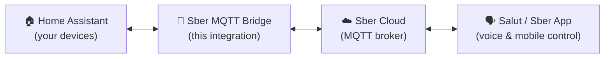

# Sber Smart Home ⟷ Home Assistant MQTT Bridge

[](https://hacs.xyz)
[](https://github.com/dzerik/sber-mqtt-bridge/releases)
[](LICENSE.txt)
[](tests/hacs/)
[](https://github.com/dzerik/sber-mqtt-bridge/actions/workflows/ci.yaml)
[](https://github.com/dzerik/sber-mqtt-bridge/actions/workflows/hacs.yml)
[](https://github.com/dzerik/sber-mqtt-bridge/actions/workflows/hassfest.yml)
[](https://github.com/dzerik/sber-mqtt-bridge/releases)

**[Документация на русском / Russian documentation](README.md)** | **[Documentation (GitHub Pages)](https://dzerik.github.io/sber-mqtt-bridge/)**

> [!IMPORTANT]
> **🧪 PUBLIC TESTING — Testers wanted!**
> 
> The project has entered **public testing**. Core functionality is stable, but the
> diversity of real-world Home Assistant devices is enormous, and we need your help
> to uncover edge cases and polish the mapping.
>
> **How to help:**
> - Install the integration via HACS and connect your devices to Sber
> - Share your experience in [Tester Feedback](https://github.com/dzerik/sber-mqtt-bridge/issues/new?template=tester_feedback.yml) —
>   what works, what doesn't, which device models you tried
> - Clear bugs go to [Bug Report](https://github.com/dzerik/sber-mqtt-bridge/issues/new?template=bug_report.yml)
>
> APIs and configuration may still change until the `2.0.0` release. Thanks to everyone testing!

---

> *"Salut, turn on the kitchen light"* — and your Zigbee switch, connected through Home Assistant, obeys.

If you've built a smart home on Home Assistant, you know the feeling: everything works, automations are humming, your dashboard looks perfect — but the moment someone in your household asks Salut to turn off the lights, the two worlds have no idea each other exist.

**Sber Smart Home MQTT Bridge** solves exactly this. It's a native Home Assistant integration that makes your HA devices visible to the Sber ecosystem — Salut voice assistants, the Sber Smart Home app — without extra servers, addons, or duct tape. One component, one UI setup, and two worlds start working as one.

The idea is simple: take the best of both ecosystems. Home Assistant brings thousands of integrations, flexible automations, and a strong community. Sber brings voice assistants, a polished mobile app, and a growing lineup of smart devices. This bridge lets you use both worlds at once, without choosing between them.

## How It Works

The integration establishes an MQTT connection to the Sber cloud, translates your HA devices into the Sber Smart Home format, and synchronizes state changes in both directions in real time. Commands from Salut become HA service calls; changes in HA are instantly reflected in the Sber app.



### How Data Is Updated

The bridge polls nothing — every update is pushed:

- **Home Assistant → Sber.** The bridge listens to state changes of the exposed entities and sends
  the new state to Sber right away, coalescing changes within a short window (`debounce_delay`,
  0.1 s by default). After a Sber command the state is sent once more after `confirm_delay` (1.5 s),
  so attributes HA updates with a delay reach the app.
- **Sber → Home Assistant.** Commands and state requests arrive from the Sber cloud over MQTT and
  immediately become Home Assistant service calls or replies.
- **The device list** is published to Sber on connect, when the set or the settings of devices
  change, and when the cloud asks for it — waiting for devices to load (see "Device sync timing").
- **The bridge's diagnostic entities** are updated by notifications from the bridge itself: bursts
  are coalesced (at most one write every 5 seconds per entity), while a connection phase change and a
  lost connection show at once.
- **The broker connection** is kept open permanently; after a drop the bridge reconnects with a
  growing pause from 5 seconds to 5 minutes (`reconnect_interval_min` / `reconnect_interval_max`).

## Features

- Native HA integration -- installs via HACS, no addons required
- Config Flow UI -- set up entirely from the HA interface
- Bulk entity selection -- add all entities, by domain, by label, or pick individually
- Entity type overrides -- change Sber category per entity via UI or YAML
- **Entity Linking** -- link battery, humidity, temperature sensors to a primary device so one physical device = one Sber device
- Auto-detection of related entities by shared `device_id` in the wizard
- Smart deduplication -- when a device has both `light` and `switch` entities, only the richer one is exposed
- Real-time state sync -- HA changes are instantly reflected in Sber (with 100ms debounce)
- Voice control through all Sber assistants (Salut, Athena, Joy)
- **28 Sber categories (27 device types + hub)** with automatic mapping
- YAML customization -- sber_type, sber_name, sber_room, sber_nicknames, sber_groups, sber_features, and more
- Label-based entity filtering -- expose entities by HA labels
- HA Repairs integration -- automatic issue detection (missing entities, connection problems)
- Persist redefinitions -- Sber app renames/rooms survive HA restart
- Auto re-publish config when Sber asks about unknown entities
- Pydantic protocol validation -- strict typing for Sber JSON messages
- **Automatic Sber spec drift detection** -- weekly CI scraper pulls canonical schemas from `developers.sber.ru`, diffs against our models, opens a PR on divergence (see `tools/fetch_sber_schemas.py`, `tools/codegen.py`)
- **Runtime feature-type validation** -- a `FEATURE_TYPES` dict generated from Sber docs catches mismatches (e.g. PIR sent as BOOL instead of ENUM) before any MQTT publish
- **Obligatory-feature validation (✔︎ markers)** -- `CATEGORY_OBLIGATORY_FEATURES` is auto-built from Sber's "Available device functions" table and guarantees each device emits the full mandatory feature set (e.g. a `valve` missing `open_percentage` is caught before publish)
- Connection health monitoring and diagnostics
- Device acknowledgment tracking -- see which devices Sber has confirmed
- Automatic MQTT reconnection with exponential backoff (5s -> 5min)
- SSL certificate verification (configurable)
- Translations: English and Russian
- CI/CD: ruff, pytest, HACS validation, hassfest, Sber spec drift detection
- **1760+ tests**

## Implementation Details

### Typed Constants (sber_constants.py)

The `sber_constants.py` module provides strictly typed `StrEnum` constants for the entire Sber protocol:
- **SberFeature** — 74 device feature keys (all protocol feature names)
- **SberValueType** — value types (`BOOL`, `INTEGER`, `ENUM`, `COLOUR`, `FLOAT`)
- **HAState** — Home Assistant states (`on`, `off`, `open`, `closed`, etc.)
- **MqttTopicSuffix** — MQTT topic suffixes

### Pydantic Value Helpers

Factory functions for building Sber protocol values:
- `make_state()` — build a state structure
- `make_bool_value()` — boolean value
- `make_integer_value()` — integer value (returns string per Sber spec)
- `make_enum_value()` — enum value
- `make_colour_value()` — HSV colour value

### HA Context Propagation

Commands from Sber are dispatched into Home Assistant with a populated `Context`, ensuring correct logbook attribution. HA logs show that a command originated from the Sber integration.

### Value Change Diffing

The `has_significant_change()` method compares new state against the previous one before each publish. This eliminates unnecessary MQTT publishes when HA polls without an actual value change.

### Online Status Logic

Online status logic is differentiated by sensor type:
- **Event-based** binary_sensors (motion, door, leak): `unknown` = **online** (sensor is waiting for an event)
- **Value-based** sensors (temperature, humidity): `unknown` = **offline** (no data = no connection)
- The **"Loading..."** badge in the panel means HA has not yet received any state from the entity

## Supported Device Types

| HA Domain | Sber Category | Capabilities | Linkable roles |
|-----------|---------------|--------------|----------------|
| `light` | light | On/off, brightness, color (HSV), color temperature | -- |
| `light` (LED strip) | led_strip | LED strip with color/brightness | -- |
| `switch` | relay | On/off | -- |
| `switch` (outlet) | socket | On/off (smart socket icon in Sber) | -- |
| `script` | relay | Execute script | -- |
| `button` | relay | Press button | -- |
| `cover` | curtain | Open/close/stop, position 0-100% | -- |
| `cover` (blind/shade) | window_blind | Open/close/stop, position 0-100% | -- |
| `climate` | hvac_ac | On/off, temperature, fan mode, swing, HVAC mode | temperature |
| `climate` (radiator) | hvac_radiator | On/off, temperature (25-40C default) | -- |
| `climate` (heater) | hvac_heater | Heater | -- |
| `climate` (floor heating) | hvac_underfloor_heating | Underfloor heating | -- |
| `sensor` (temperature) | sensor_temp | Temperature reading (x10 precision) | battery, signal_strength, humidity |
| `sensor` (humidity) | sensor_humidity | Humidity reading (0-100%) | battery, signal_strength, temperature |
| `binary_sensor` (motion) | sensor_pir | Motion detected (boolean) | battery, signal_strength |
| `binary_sensor` (door) | sensor_door | Open/close state | battery, signal_strength |
| `binary_sensor` (moisture) | sensor_water_leak | Leak detected (boolean) | battery, signal_strength |
| `binary_sensor` (smoke) | sensor_smoke | Smoke detector | battery, signal_strength |
| `binary_sensor` (gas) | sensor_gas | Gas leak detector | battery, signal_strength |
| `input_boolean` | scenario_button | Click / double click events | -- |
| `event` (Zigbee buttons) | scenario_button | Click / double click / long press | -- |
| `valve` | valve | Open/close valve | -- |
| `humidifier` | hvac_humidifier | On/off, target humidity, work mode | humidity |
| `fan` | hvac_fan | Fan/ventilator | -- |
| `fan` (purifier) | hvac_air_purifier | Air purifier | -- |
| `water_heater` | hvac_boiler | Boiler/water heater | -- |
| `water_heater` (kettle) | kettle | Smart kettle | -- |
| `media_player` | tv | Television | -- |
| `vacuum` | vacuum_cleaner | Robot vacuum | -- |
| -- (override only) | intercom | Intercom | -- |

## Prerequisites -- Setting Up Sber Studio

Before installing the integration, you need MQTT credentials from Sber:

### Step 1: Register in Sber Studio

1. Go to [Sber Studio](https://developers.sber.ru/studio/workspaces/)
2. Sign in with your Sber ID (same account as Sber Smart Home app)
3. Create a new workspace if you don't have one

### Step 2: Create an Integration Project

1. In Sber Studio, go to **Smart Home** section
2. Click **Create Project** (or **Создать проект**)
3. Select **MQTT Integration** type
4. Give it a name (e.g. "Home Assistant Bridge")

### Step 3: Get MQTT Credentials

1. Open your project settings
2. Find the **MQTT Connection** section
3. Copy **Login** and **Password** -- you will need these in HA
4. The broker address is `mqtt-partners.iot.sberdevices.ru`, port `8883`

For detailed instructions, see [Sber MQTT-to-Cloud documentation](https://developers.sber.ru/docs/ru/smarthome/mqtt-diy/mqtt-to-diy).

### Step 4: Link Sber App

1. Open the **Sber Smart Home** app on your phone
2. Go to **Settings** > **Connected Services** (or **Подключенные сервисы**)
3. Your MQTT integration should appear -- enable it
4. Devices will appear in the app after the bridge connects

## Installation

### HACS (recommended)

[](https://my.home-assistant.io/redirect/hacs_repository/?owner=dzerik&repository=sber-mqtt-bridge&category=integration)

Click the button above — HACS opens on the repository page, just press **Download**.

Or manually:

1. Open **HACS** in Home Assistant
2. Click the three dots menu > **Custom repositories**
3. Add `https://github.com/dzerik/sber-mqtt-bridge` with category **Integration**
4. Search for **"Sber Smart Home MQTT Bridge"** and click **Install**
5. **Restart Home Assistant**

### Manual

1. Download the [latest release](https://github.com/dzerik/sber-mqtt-bridge/releases)
2. Copy `custom_components/sber_mqtt_bridge/` to your HA `config/custom_components/`
3. Restart Home Assistant

## Configuration

### Initial Setup

1. Go to **Settings** > **Devices & Services** > **Add Integration**
2. Search for **"Sber Smart Home MQTT Bridge"**
3. Enter your Sber MQTT credentials:

| Parameter | Required | Default | Description |
|-----------|----------|---------|-------------|
| MQTT Login | Yes | -- | Login from Sber Studio project |
| MQTT Password | Yes | -- | Password from Sber Studio project |
| MQTT Broker | No | `mqtt-partners.iot.sberdevices.ru` | Broker address |
| MQTT Port | No | `8883` | Broker port (TLS) |
| Verify SSL | No | `true` | Verify broker certificate |

### Integration Options ("Configure" button)

Day-to-day device management happens in the **Sber Bridge** sidebar panel. The integration
options dialog is the fallback that works without the panel: **Settings** > **Devices & Services** >
**Sber Smart Home MQTT Bridge** > **Configure**.

The first screen asks "What would you like to do?":

| Action | What happens |
|--------|--------------|
| **Entity type preview (N)** | Lists the exposed entities grouped by Sber category; ✏️ marks a manual type override. Changes nothing |
| **Open Sber Bridge panel (recommended)** | Closes the dialog without changes — continue in the panel |
| **Advanced entity management (fallback)** | Opens the "Advanced Options" menu with the three sections below |

#### Entity selection

| Mode | What it does |
|------|--------------|
| **Select entities manually** | Searchable list: checked entities are exposed, unchecked ones are removed from Sber |
| **Add all entities by domain** | Adds the enabled entities of the chosen HA domains to the current selection. One entity is taken per HA device — the one Sber can control best (see "Smart deduplication") |
| **Add entities by label** | Adds every supported entity carrying at least one of the chosen HA labels to the current selection |
| **Add ALL supported entities** | **Replaces** the list with every supported entity (deduplicated per device) |
| **Remove ALL entities** | Clears the list: the bridge publishes a config without devices and they disappear from the Sber app |

**Smart deduplication** ("by domain" and "ALL" modes only): when an HA device registers several
entities, e.g. `light.kitchen` and `switch.kitchen`, only one is added — the one with the highest
domain priority: light > cover > climate > water_heater > humidifier > vacuum > media_player > fan >
valve > lock > switch > script > button, input_boolean, event > binary_sensor > sensor. Entities without an
HA device are always added.

#### Entity type overrides

One dropdown of Sber categories per exposed entity. **Auto** (the default) detects the category from
the domain and `device_class`. Change it when detection is wrong: e.g. a `switch` driving a lamp →
`light`, or a relay → `socket` to get the outlet icon in the app. When no entity is exposed yet, the
section says so and closes.

#### Device sync timing

Sber treats every config publish as the **complete** device list: a device missing from it is dropped
by the cloud and, when it shows up again, registered anew in the hub's room. That is why, at start-up
and after changes, the bridge waits for devices to get their state.

| Option | Default | Range | Purpose |
|--------|:-------:|:-----:|---------|
| **Settle delay, s** (`config_settle_delay`) | `5` | 0–300 | While devices are still loading, the list is published once no new device has reported for this many seconds. When every device has already loaded, the list goes out at once. Raise it if devices move to the hub's room after an HA restart — e.g. battery-powered Zigbee sensors that wake up slowly |
| **Max wait for devices, s** (`config_max_wait`) | `120` | 1–900 | Upper bound on waiting: when it runs out the list is published without the devices that have not loaded, and a warning naming them is logged. Raise it for a large Zigbee/Z-Wave mesh; lower it if an entity that never loads holds up everything else |

Only devices Sber already knows hold the publish back: a new device that has not loaded yet simply
joins a later publish. Both options are also on the panel's **Settings** tab and apply without
reloading the integration.

### Bridge Settings (panel "Settings" tab)

**Sber Bridge** panel > **Settings** tab. Values are stored with **Save** and applied to the running
bridge without reloading the integration; **Reset to Defaults** fills in the defaults (they must be
saved as well). An out-of-range value rejects the whole request — nothing from it is saved.

| Setting | Default | Range | Purpose and when to change |
|---------|:-------:|:-----:|----------------------------|
| **Min reconnect interval, s** (`reconnect_interval_min`) | `5` | 1–3600 | Pause before the first retry after the connection drops; every failed attempt doubles it. The pause returns to this value after a session that stayed up for 60 seconds. Raise it if the broker rejects too frequent connections |
| **Max reconnect interval, s** (`reconnect_interval_max`) | `300` | 1–86400 | Ceiling the pause between attempts grows to. Lower it so the bridge comes back sooner after a long internet outage. Keep it at or above the minimum |
| **Verify SSL certificate** (`sber_verify_ssl`) | on | on/off | TLS certificate check of the broker. Turn off only if the broker uses a custom or self-signed certificate. Takes effect on the next connection |
| **State publish debounce, s** (`debounce_delay`) | `0.1` | 0–60 | State changes arriving within this window go to Sber in one message; under a continuous stream a publish still happens at least once every five windows. `0` publishes at once. Raise it if devices send many small updates in a row |
| **Max MQTT payload, bytes** (`max_mqtt_payload_size`) | `1000000` | 1024–10000000 | Incoming Sber messages larger than this are dropped with a log warning — memory protection. Normally leave as is |
| **Config settle delay, s** (`config_settle_delay`) | `5` | 0–300 | Same as "Settle delay" in the integration options (see above) |
| **Max wait for devices, s** (`config_max_wait`) | `120` | 1–900 | Same as "Max wait for devices" (see above) |
| **Delayed state confirmation, s** (`confirm_delay`) | `1.5` | 0–60 | This many seconds after a Sber command the bridge publishes the device state once more, so attributes HA updates with a delay reach the app. Raise it for slow devices whose old value stays in the app after a command |
| **Silent-rejection audit delay, s** (`ack_audit_delay`) | `60` | 1–3600 | This many seconds after a config publish the bridge checks which devices Sber never confirmed and logs a warning. A new value applies to audits scheduled after saving |
| **MQTT message log buffer** (`message_log_size`) | `50` | 1–10000 | How many recent records the DevTools logs keep (MQTT messages, traces, state diffs, validation issues, command confirmations). Raise it while debugging: records are kept in memory |
| **Auto-assign parent_id** (`hub_auto_parent_id`, "Hub Device" card) | off | on/off | Every device without an explicit `parent_id` gets `parent_id: root`, i.e. becomes a child of the bridge hub. Applied on the next config publish |
| **Emit ha_serial_number marker** (`ha_serial_number_enabled`) | off | on/off | Adds `partner_meta.ha_serial_number` to every device: the serial number or MAC from the HA device registry, otherwise a marker of this HA instance (`ha-<8 characters>`). Turn on if you use an integration that imports Sber devices back into HA: it uses the marker to detect the loop. Applied on the next config publish |
| **Show silent-rejection repair tile** (`silent_rejection_alerts`) | off | on/off | Devices Sber has never confirmed are reported in **Settings** > **Repairs**. Off by default: Sber may not ask for an accepted device's state for hours, which would make the tile a false alarm. The audit data is visible in the panel and the log either way |

### Per-Device Settings

Opened by clicking a device in the panel table. Stored per entity and applied without reloading the
integration.

**Impulse gate** (`gate` category, a `switch` / `button` / `script` relay with a linked position
sensor):

| Setting | Default | Range | Purpose |
|---------|:-------:|:-----:|---------|
| **Inverted contact** (`invert_contact`) | off | on/off | Turn on when the linked sensor reports `on` while the gate is closed |
| **Impulse service** (`impulse_service`) | `auto` | `auto`, `toggle`, `turn_on` | `switch` relays only: `auto` and `toggle` call `switch.toggle`, `turn_on` calls `switch.turn_on`. A `button` is always pressed with `press`, a `script` is started with `turn_on` |
| **Leaf travel time, s** (`travel_time`) | `0` | 0–600 | `0` disables it: the position changes only when the sensor reports. With a value set the gate reports "opening" / "closing" right after the impulse; the Sber app blocks the control button for that whole time |
| **Auto-close delay, s** (`auto_close_time`) | `0` | 0–3600 | Enter the delay after which your gate board closes the leaf by itself. `0` disables it. When it runs out the gate reports "closing" until the sensor says otherwise. Set the travel time as well: without it "closing" is assumed to last 30 seconds |

**Kettle** (`kettle` category, a `water_heater` with operation modes):

| Setting | Default | Allowed values | Purpose |
|---------|:-------:|:--------------:|---------|
| **"Off" mode** (`off_mode`) | auto-detect (`off`) | a mode from the entity's `operation_list` | HA mode the bridge uses to switch the kettle off |
| **"Boil" mode** (`boil_mode`) | auto-detect (`boil`) | a mode from `operation_list` | HA mode used to boil |
| **"Heat to setpoint" mode** (`heat_mode`) | auto-detect (`heat`, `electric`, `eco`, `gas`, `heat_pump`, `high_demand`, `performance` — first match) | a mode from `operation_list` | HA mode used to heat to the target temperature |

Change a mode when auto-detection did not find the right one (the panel shows which mode is in use).
When no mode is found, or the kettle reports no modes, the bridge simply turns it on and off.

**Temperature sensor** (`sensor_temp` category): the `temp_unit_view` option (default `true`)
decides whether the `temp_unit_view` feature — the temperature display scale — is published. The
panel has no field for it: press **Export** in the toolbar, set
`"gate_options": {"sensor.<name>": {"temp_unit_view": false}}` in the file (the `gate_options` block
holds the settings of every device, not only gates) and load the file with **Import**. Turn it off
only if you need the minimal feature set: changing the feature set makes Sber register the device
anew, and it loses its room.

### YAML Customization

You can fine-tune how entities appear in Sber by adding customization in `configuration.yaml`:

```yaml
sber_mqtt_bridge:
  entity_config:
    light.kitchen:
      sber_type: light           # Override Sber category
      sber_name: "Kitchen Light" # Custom name in Sber app
      sber_room: "Kitchen"       # Room assignment
      sber_nicknames:            # Voice command aliases
        - "main light"
        - "ceiling light"
      sber_groups:               # Group membership
        - "kitchen_lights"
      sber_features_add:         # Add Sber features
        - "colour_setting"
      sber_features_remove:      # Remove Sber features
        - "colour_temp"
      sber_partner_meta: {}      # Custom partner metadata
      sber_parent_id: "light.living_room"  # Parent device ID
```

| Parameter | Description |
|-----------|-------------|
| `sber_type` | Override the automatically detected Sber category (e.g., `relay` -> `socket`) |
| `sber_name` | Custom device name shown in Sber app and used for voice commands |
| `sber_room` | Room assignment in Sber (overrides app-assigned room) |
| `sber_nicknames` | Alternative names for voice control |
| `sber_groups` | Group IDs for device grouping in Sber |
| `sber_features_add` | Additional Sber features to advertise |
| `sber_features_remove` | Sber features to suppress |
| `sber_partner_meta` | Custom metadata passed to Sber |
| `sber_parent_id` | Parent device entity ID for hierarchical grouping |

### Entity Linking

Entity Linking lets you attach auxiliary HA entities (battery sensor, signal strength, humidity, temperature) to a primary Sber device. This models the physical reality: one Zigbee sensor produces several HA entities but should appear as a single device in the Sber app.

**Without linking**: a leak sensor with a battery sensor creates two separate Sber devices.
**With linking**: the battery level is automatically included in the leak sensor's Sber state — one device, full data.

#### Supported link roles by Sber category

| Sber Category | Linkable roles |
|---------------|----------------|
| sensor_water_leak | battery, signal_strength |
| sensor_pir | battery, signal_strength |
| sensor_door | battery, signal_strength |
| sensor_temp | battery, signal_strength, humidity |
| sensor_humidity | battery, signal_strength, temperature |
| hvac_ac | temperature |
| hvac_humidifier | humidity |

#### Wizard flow

When adding a new device through the panel wizard:

1. Select device type and primary entity.
2. The wizard automatically detects related entities that share the same HA `device_id`.
3. Compatible entities are pre-checked (shown in green). Incompatible ones are shown greyed out with "(not supported)".
4. Set a name and confirm.
5. Linked entities disappear from the available entities list — they are managed through the primary device.

Linked entity data (battery level, signal strength, etc.) is included in every Sber state publish for the primary device. State changes of a linked entity trigger an immediate republish of the primary device's state.

### Sidebar Panel

The integration adds a dedicated panel to the Home Assistant sidebar (SPA application):

| Tab | Description |
|-----|-------------|
| **Devices** | Table of all exposed devices: name, entity_id, Sber category, online status, Sber acknowledgment |
| **Add Device Wizard** | Step-by-step wizard: select device type, primary entity, and linked entities (battery, signal, etc.) |
| **DevTools** | Debug tool: raw config and states in JSON, real-time MQTT message log |
| **Settings** | Bridge settings — see [Bridge Settings](#bridge-settings-panel-settings-tab) |

**Entity Preview in wizard**: when selecting a device type, the wizard shows a preview of how the entity will appear in Sber — which features will be published.

### Integration Entities

The integration creates a **Sber MQTT Bridge** service device with diagnostic entities — handy for
automations on a lost connection. While the bridge is stopped they are unavailable.

| Entity | Type | Value |
|--------|------|-------|
| **Sber connection** | binary_sensor (connectivity) | On while the bridge holds a connection to the Sber broker |
| **Connection phase** | sensor (enum) | "Starting", "Connecting", "Waiting for Sber", "Ready", "Login or password rejected", "Disconnected" |
| **Devices known to Sber** | sensor | How many exposed devices the bridge believes the Sber cloud holds |
| **Devices never confirmed by Sber** | sensor | How many exposed devices the cloud has never confirmed |
| **Errors from Sber** | sensor (total increasing) | Count of error messages sent by the cloud |
| **Last Sber error code** | sensor | Code of the last error sent by the cloud |

### Managing Devices in Sber App

After entities are exposed:

1. Open the **Sber Smart Home** app
2. Devices appear automatically (may take 10-30 seconds)
3. **Rename devices**: tap the device > settings icon > change name
4. **Assign rooms**: tap the device > settings icon > select room
5. **Voice control**: say *"Салют, включи свет на кухне"* (Salut, turn on kitchen light)

**Note**: Room assignments and renames made in the Sber app are stored locally in the integration and will be included in future config publishes. These persist across HA restarts.

## Known Limitations

- **Internet is required.** The bridge works only through Sber's cloud MQTT broker; there is no local
  control without the cloud.
- **One integration entry** per Home Assistant. If there are several (e.g. left over from an old
  version), only one runs; the others do not start and show a setup error — delete the extra ones.
- **Sber treats every publish as the complete device list.** A device missing from a publish is
  dropped by the cloud and registered anew in the hub's room when it comes back. The bridge waits for
  devices to load, but a device that has no state after `config_max_wait` is left out of the publish.
- **Supported categories only.** Only domains and capabilities that have a Sber category and features
  are exposed (see "Supported Device Types"); other device attributes are not visible in the app.
- **Transitional states block the app button.** While a gate reports "opening" / "closing", the Sber
  app does not let you control it.
- **The silent-rejection audit is imprecise:** Sber may not ask for an accepted device's state for
  hours, which is why the repair tile for it is off by default.
- **The panel is available to Home Assistant administrators only.**

## Troubleshooting

| Problem | Solution |
|---------|----------|
| Cannot connect | Verify credentials in Sber Studio. Check that your project is active. If the broker is unreachable at startup, Home Assistant retries the integration setup on its own; if the broker rejects the password, it asks you to re-authenticate. |
| SSL errors | Try disabling "Verify SSL" in integration settings (for custom CA). |
| Entities not in Sber | Check Options > select entities. Check HA logs for mapping warnings. |
| Devices appear/disappear | Check HA logs for reconnection messages. Ensure stable internet. |
| Devices move to the hub's room after an HA restart | Some devices had not loaded when the list was published, so Sber registered them anew. Raise "Settle delay" and "Max wait for devices" (**Configure** > **Advanced entity management** > **Device sync timing**, or the panel's **Settings** tab); the devices that did not load are named in a log warning. |
| Duplicate devices | Remove duplicates in Options > manual mode. Or use "Remove ALL" then "Add ALL" for clean reset. |
| Sensors show wrong values | Enable debug logging and check entity mapping in logs. |
| Missing entities or connection issues | Check **Settings > Repairs** -- the integration creates repair issues automatically for common problems. |

### Debugging via DevTools (Sidebar Panel)

The **DevTools** tab in the Sidebar Panel provides debugging tools without restarting HA:
- **Raw Config** — full device configuration in the JSON format sent to Sber
- **Raw States** — current states of all devices in Sber format
- **MQTT Log** — real-time log of MQTT messages (incoming and outgoing)

### HA Repairs

The integration uses Home Assistant's Repairs system to notify you about problems. Go to **Settings** > **Repairs** to see any active issues, such as:
- Missing entities that were previously exposed
- MQTT connection failures
- Configuration problems

### Debug Logging

Add to `configuration.yaml`:

```yaml
logger:
  logs:
    custom_components.sber_mqtt_bridge: debug
```

This will show:
- `MQTT <- topic (N bytes)` -- every incoming message
- `Sber -> HA command: entity_id [keys]` -- command details
- `HA -> Sber state: entity_id = state` -- state publishes
- `Entity xxx -> Sber category (domain, device_class)` -- mapping decisions
- `Sber error (#N): {...}` -- errors from Sber cloud

### Diagnostics

Go to **Settings** > **Devices & Services** > **Sber Smart Home MQTT Bridge** > **three dots** > **Download diagnostics**. The file contains:
- Connection status and uptime
- Message counters (received, sent, errors)
- List of acknowledged/unacknowledged entities
- Entity configuration

## Removing the Integration

### 1. Remove the devices from Sber (optional)

When the entry is deleted the bridge simply disconnects from the broker and **sends nothing** to Sber,
so the devices stay in the Sber Smart Home app: they no longer update or respond to commands. To have
them removed automatically, clear the list **before** deleting the entry, while the bridge is
connected:

1. Delete the devices in the **Sber Bridge** panel table, or open **Configure** >
   **Advanced entity management (fallback)** > **Entity selection** > **Remove ALL entities**.
2. The bridge publishes a config without devices, and the cloud removes them from the app.
3. Check that the devices are gone from the app, then continue with the next step.

If the entry is already deleted, remove the leftover devices manually in the Sber Smart Home app. If
you no longer need the MQTT project, disconnect the integration in the app where you connected it
(**Settings** > **Connected Services**) and delete the project in
[Sber Studio](https://developers.sber.ru/studio/workspaces/) — its login and password stop working.

### 2. Delete the integration entry in Home Assistant

1. **Settings** > **Devices & Services** > **Sber Smart Home MQTT Bridge**.
2. Entry menu (three dots) > **Delete**.

Deleting the entry also removes the **Sber Bridge** sidebar panel, the "Sber MQTT Bridge" service
device with its diagnostic entities, the integration's **Repairs** issues and every setting stored in
the entry: the exposed entity list, type overrides, entity links, per-device settings, names and rooms
from the Sber app, and the bridge settings. The Home Assistant entities you exposed are not affected.

Remove the `sber_mqtt_bridge:` section from `configuration.yaml` (if you added one) and the
`custom_components.sber_mqtt_bridge` line from your `logger:` settings by hand.

### 3. Remove the integration files

- **HACS:** **HACS** > find **Sber Smart Home MQTT Bridge** > menu (three dots) > **Remove**.
- **Manual install:** delete the `config/custom_components/sber_mqtt_bridge/` folder.

Then restart Home Assistant.

## Trademarks & Legal Notice

All product names, logos, and brands mentioned in this project are property of their respective owners:

- **Sber**, **SberDevices**, **Salut**, **Sber Smart Home** are trademarks of [Sber](https://www.sber.ru/) (PAO Sberbank).
- **Home Assistant** is a trademark of the [Home Assistant](https://www.home-assistant.io/) project.
- **HACS** (Home Assistant Community Store) is an independent community project.

This project is not affiliated with, endorsed by, or sponsored by Sber, SberDevices, or the Home Assistant project. It is an independent open-source community integration.

## Links

- [Project Documentation (GitHub Pages)](https://dzerik.github.io/sber-mqtt-bridge/)
- [API Reference](https://dzerik.github.io/sber-mqtt-bridge/api/)
- [Sber Smart Home Developer Portal](https://developers.sber.ru/docs/ru/smarthome)
- [Register in Sber Studio](https://developers.sber.ru/docs/ru/smarthome/space/registration)
- [MQTT-to-Cloud Integration Guide](https://developers.sber.ru/docs/ru/smarthome/mqtt-diy/mqtt-to-diy)
- [Supported Device Categories](https://developers.sber.ru/docs/ru/smarthome/c2c/devices)

## Contributing

See [CONTRIBUTING.md](CONTRIBUTING.md) for development setup and guidelines.

## License

[MIT](LICENSE.txt)

## Community and support

Telegram chat: **[@ha_sber_chat](https://t.me/ha_sber_chat)** — a shared chat for the
[ha-sberhome](https://github.com/dzerik/ha-sberhome),
[ha-sboom-card](https://github.com/dzerik/ha-sboom-card),
[holabrain-ha](https://github.com/dzerik/holabrain-ha) and
[sber-mqtt-bridge](https://github.com/dzerik/sber-mqtt-bridge) integrations.
Setup questions, new device reports, early builds. The chat is mostly in Russian,
English is welcome. For bugs please open an issue in the matching repository.
