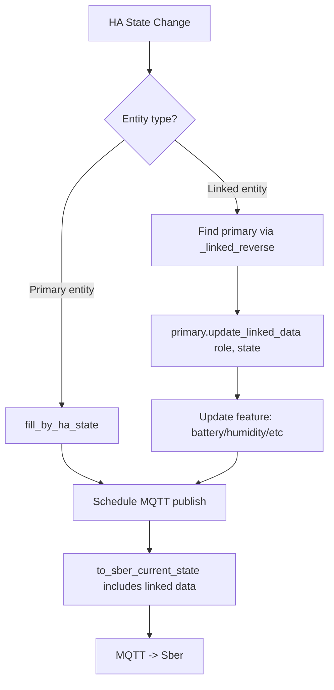

# Entity Linking / Grouping — Research & Implementation Plan

## Problem

1 HA entity = 1 Sber device. Физическое устройство (датчик протечки Tuya) имеет 3-5 entities в HA:
- `binary_sensor.*_water_leak` (moisture) -> `sensor_water_leak`
- `sensor.*_temperature` -> `sensor_temp`
- `sensor.*_battery` -> не маппится
- `binary_sensor.*_tamper` -> не маппится

Пользователь видит 2 отдельных устройства в Sber вместо одного.

## Исследование конкурентных решений

### Yandex Smart Home (dext0r/yandex_smart_home)

**Подход: автоматические properties из атрибутов entity.**

Yandex НЕ группирует entities. Каждый HA entity = 1 Yandex device. Но они автоматически
извлекают данные из **атрибутов самого entity**:

- `climate.*` -> свойства `temperature` (из `current_temperature`), `humidity` (из `current_humidity`)
- `binary_sensor.*` -> если есть атрибут `battery_level`, автоматически добавляется property battery
- `sensor.*` -> тип определяется по `device_class`

**Реализация**: паттерн `STATE_PROPERTIES_REGISTRY` — список классов-свойств. Для каждого entity
система перебирает все возможные property-классы и проверяет `supported` (наличие нужного атрибута).
Если supported — property автоматически добавляется к устройству.

**Плюсы**: Zero-config, всё автоматически.
**Минусы**: Нет группировки отдельных entities. `sensor.battery` от датчика протечки нельзя
привязать к `binary_sensor.water_leak` — они будут отдельными устройствами (или battery вообще
не будет видна в Yandex).

### TohaRG2/MQTT-Sber-HA

**Подход: ручная конфигурация composite-устройств.**

Пользователь **вручную** создаёт виртуальное Sber-устройство и привязывает несколько HA entities:
```json
{
  "device_type": "sensor_temp",
  "attributes": {
    "temperature_entity": "sensor.temp",
    "humidity_entity": "sensor.hum",
    "battery_entity": "sensor.bat"
  }
}
```

**Плюсы**: Полный контроль, гибкость.
**Минусы**: Полностью ручная настройка, нет автоопределения, нет UI-wizard.

## Sber Protocol: Что поддерживает каждая category

Из документации Sber (developers.sber.ru):

| Category | Доп. features (universal) | Специфические |
|---|---|---|
| `sensor_water_leak` | `battery_percentage`, `battery_low_power`, `signal_strength` | `water_leak_state` |
| `sensor_pir` | `battery_percentage`, `battery_low_power`, `signal_strength` | `pir` |
| `sensor_door` | `battery_percentage`, `battery_low_power`, `signal_strength`, `tamper_alarm` | `doorcontact_state` |
| `sensor_temp` | `battery_percentage`, `battery_low_power`, `signal_strength` | `temperature`, `humidity`, `air_pressure` |
| `sensor_smoke` | `battery_percentage`, `battery_low_power`, `signal_strength` | `smoke_state` |

**Важно**: `parent_id` в Sber — это иерархия (дочернее устройство -> хаб), НЕ слияние features.
Для объединения данных нужно добавлять features к одному устройству.

## Выбранный подход: Гибрид (Auto + Manual Linking)

### Концепция

**Двухуровневая система**:

1. **Auto-linking по device_id** — entities с одним `device_id` в HA автоматически
   объединяются. Основное entity (по приоритету домена) становится primary, остальные —
   linked (батарея, сигнал, доп. сенсоры).

2. **Manual linking в Wizard** — для entities без `device_id` (standalone sensors)
   пользователь может выбрать связи вручную.

### UX Flow: Wizard Step 2 (после выбора типа и primary entity)

```
Step 2: "Датчик протечки — binary_sensor.water_leak"

Связанные сущности (автоопределение по устройству):
  [x] sensor.water_leak_battery     -> battery_percentage   (auto)
  [x] sensor.water_leak_temperature -> temperature          (compatible, optional)
  [ ] binary_sensor.water_leak_tamper -> tamper_alarm        (not compatible with sensor_water_leak)
  [ ] sensor.water_leak_signal      -> signal_strength       (auto)

  [ ] + Добавить entity вручную...
```

Правила:
- Checkbox предвыбран для совместимых features (battery, signal)
- Несовместимые features показаны серым с пояснением
- `temperature` / `humidity` показаны как optional (пользователь решает)
- Кнопка "Добавить вручную" для standalone sensors

### Какие роли линковки доступны для каких categories

```python
ALLOWED_LINK_ROLES = {
    # Все sensor-категории поддерживают battery и signal
    "sensor_water_leak": ["battery", "signal_strength"],
    "sensor_pir":        ["battery", "signal_strength"],
    "sensor_door":       ["battery", "signal_strength", "tamper"],
    "sensor_smoke":      ["battery", "signal_strength"],
    "sensor_gas":        ["battery", "signal_strength"],
    # sensor_temp может иметь humidity и наоборот
    "sensor_temp":       ["battery", "signal_strength", "humidity"],
    "sensor_humidity":   ["battery", "signal_strength", "temperature"],
    # HVAC устройства
    "hvac_ac":           ["temperature"],  # external temp sensor
    "hvac_humidifier":   ["humidity"],     # external humidity sensor
    # Остальные категории — без линковки
}
```

### Маппинг HA device_class -> Link Role

```python
HA_DEVICE_CLASS_TO_LINK_ROLE = {
    "battery":      "battery",
    "temperature":  "temperature",
    "humidity":     "humidity",
    "moisture":     "humidity",
    "signal_strength": "signal_strength",
    "tamper":       "tamper",
}
```

## Архитектура

### Хранение

В `config_entry.options`:
```python
CONF_ENTITY_LINKS = "entity_links"

# Формат:
{
    "entity_links": {
        "binary_sensor.water_leak": {
            "battery": "sensor.water_leak_battery",
            "signal_strength": "sensor.water_leak_signal"
        },
        "sensor.temperature": {
            "humidity": "sensor.humidity",
            "battery": "sensor.battery"
        }
    }
}
```

### Фильтрация в Available Entities

Linked entities **НЕ показываются** в списке available entities и Add dialog:
```python
# В ws_get_available_entities:
linked_entity_ids = set()
for links in entity_links.values():
    linked_entity_ids.update(links.values())

# Фильтруем:
if entity_entry.entity_id in exposed_set or entity_entry.entity_id in linked_entity_ids:
    continue
```

### Потоки данных



## Этапы реализации

### Phase 1: Backend (entity linking core)
- `const.py`: `CONF_ENTITY_LINKS`, `ALLOWED_LINK_ROLES`, `HA_DEVICE_CLASS_TO_LINK_ROLE`
- `base_entity.py`: `linked_entities: dict[str, dict]`, `update_linked_data(role, state)`
- `simple_sensor.py`: обработка linked battery/signal_strength
- `sensor_temp.py`: linked humidity
- `humidity_sensor.py`: linked temperature
- `sber_bridge.py`: `_entity_links`, `_linked_reverse`, подписка на state changes linked entities

### Phase 2: WebSocket API
- `set_entity_links` — установить связи
- `suggest_links` — автоопределение по device_id
- `auto_link_all` — массовое автосвязывание
- Модификация `ws_get_devices` — показ linked entities
- Модификация `ws_get_available_entities` — фильтрация linked

### Phase 3: Frontend
- `sber-link-dialog.js` — модальное окно управления связями
- Wizard Step 2 — показ связанных entities при добавлении
- Device table — отображение linked count, expand для деталей
- Фильтрация в Add dialog

### Phase 4: Auto-detection & Polish
- Auto-link при добавлении entity через wizard
- "Auto-link all" кнопка в toolbar
- Config migration v2 -> v3
- Тесты

## Риски и решения

| Риск | Решение |
|------|---------|
| Linked entity unavailable при старте | Linked features не добавляются пока state не появится. Auto-republish при появлении. |
| Features list меняется runtime | Отслеживать changes в features list, auto-republish config при изменении. |
| Circular links | Валидация: linked entity не может быть primary. |
| Linked entity удалён из HA | Repairs issue + skip broken links при загрузке. |
| Export/import совместимость | entity_links включается в export с version bump. |
