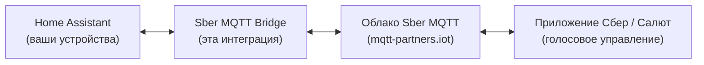

# Sber Smart Home MQTT Bridge

Интеграция Home Assistant для управления устройствами через голосовых помощников **Салют** и приложение **Сбер Умный дом**. Работает через MQTT-подключение к облаку Sber.

## Как это работает

Интеграция подключается к MQTT-брокеру Sber, публикует ваши устройства HA как устройства Сбер Умного дома и транслирует команды обратно в HA. Изменения состояний в HA мгновенно отражаются в приложении Сбер.

## Возможности

- **Нативная интеграция HA** -- устанавливается через HACS, без дополнительных аддонов
- **Настройка через UI** -- полностью из интерфейса Home Assistant
- **Массовый выбор устройств** -- добавить все, по категориям, по меткам (labels), или поштучно
- **Умная дедупликация** -- если устройство имеет и `light`, и `switch`, выбирается более функциональный вариант
- **Синхронизация в реальном времени** -- изменения в HA мгновенно видны в Сбер (debounce 100 мс)
- **Голосовое управление** через всех ассистентов Сбер (Салют, Афина, Джой)
- **28 категорий Sber (27 типов устройств + hub)** с автоматическим маппингом
- **[Entity Linking](devices.md#связывание-entity-entity-linking)** -- привязка battery, signal, humidity, temperature сенсоров к основному устройству
- **[Sidebar Panel](configuration.md#sidebar-panel)** -- встроенная SPA-панель с таблицей устройств, мастером добавления и DevTools
- **Мониторинг подключения** и диагностика
- **Автоматическое переподключение** с экспоненциальной задержкой (5 сек -- 5 мин)
- **SSL-сертификат** (настраивается)
- **Переводы**: английский и русский

## Быстрый старт

1. [Настройте проект в Sber Studio](sber-setup.md) и получите MQTT-учётные данные
2. [Установите интеграцию](installation.md) через HACS
3. [Настройте подключение и выберите устройства](configuration.md)
4. Управляйте устройствами голосом: *"Салют, включи свет на кухне!"*

## Примеры голосовых команд

- *"Салют, включи свет в гостиной"*
- *"Салют, выключи все розетки"*
- *"Салют, какая температура в спальне?"*
- *"Салют, закрой шторы"*
- *"Салют, установи температуру 23 градуса"*
- *"Салют, включи увлажнитель"*

---

## English Summary

Home Assistant custom integration for bridging HA entities to [Sber Smart Home](https://developers.sber.ru/docs/ru/smarthome) cloud via MQTT. Control your Home Assistant devices through Sber voice assistants (**Salut**) and the **Sber Smart Home** mobile app.

The integration connects to the Sber MQTT broker, publishes your HA devices as Sber Smart Home devices, and translates commands back to HA service calls. State changes in HA are instantly reflected in the Sber app.

See the navigation menu for installation, configuration, and device documentation.

## Ссылки

- [Портал разработчиков Sber Smart Home](https://developers.sber.ru/docs/ru/smarthome)
- [Руководство MQTT-to-Cloud](https://developers.sber.ru/docs/ru/smarthome/mqtt-diy/mqtt-to-diy)
- [Поддерживаемые категории устройств Sber](https://developers.sber.ru/docs/ru/smarthome/c2c/devices)
