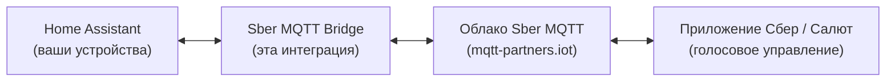

# Sber Smart Home MQTT Bridge

Интеграция Home Assistant для управления устройствами через голосовых помощников **Салют** и приложение **Сбер Умный дом**. Работает через MQTT-подключение к облаку Sber.

## Как это работает

```mermaid
flowchart LR
    HA["Home Assistant\n(ваши устройства)"]
    Bridge["Sber MQTT Bridge\n(эта интеграция)"]
    Cloud["Облако Sber MQTT\n(mqtt-partners.iot)"]
    App["Приложение Сбер / Салют\n(голосовое управление)"]

    HA <--> Bridge <--> Cloud <--> App
```

Интеграция подключается к MQTT-брокеру Sber, публикует ваши устройства HA как устройства Сбер Умного дома и транслирует команды обратно в HA. Изменения состояний в HA мгновенно отражаются в приложении Сбер.

## Как обновляются данные

Мост ничего не опрашивает — все обновления приходят push-сообщениями:

- **Home Assistant → Сбер.** Мост подписан на изменения состояний экспортируемых сущностей и
  отправляет новое состояние в Сбер сразу, объединяя изменения в пределах короткого окна
  (`debounce_delay`, по умолчанию 0,1 с). После команды из Сбера состояние отправляется ещё раз
  через `confirm_delay` (1,5 с), чтобы в приложение попали атрибуты, которые HA обновляет с
  задержкой.
- **Сбер → Home Assistant.** Команды и запросы состояния приходят из облака Сбера по MQTT и сразу
  превращаются в вызовы служб Home Assistant или ответы.
- **Список устройств** отправляется в Сбер при подключении, при изменении набора или настроек
  устройств и по запросу облака — с ожиданием загрузки устройств (см. [«Тайминги синхронизации
  устройств»](configuration.md)).
- **Диагностические сущности моста** обновляются по уведомлениям самого моста: частые изменения
  объединяются (не больше одной записи в 5 секунд на сущность), а смена фазы подключения и потеря
  связи показываются сразу.
- **Связь с брокером** держится постоянно; после обрыва мост переподключается с растущей паузой
  от 5 секунд до 5 минут (`reconnect_interval_min` / `reconnect_interval_max`).

## Возможности

- **Нативная интеграция HA** -- устанавливается через HACS, без дополнительных аддонов
- **Настройка через UI** -- полностью из интерфейса Home Assistant
- **Массовый выбор устройств** -- добавить все, по категориям, по меткам (labels), или поштучно
- **Умная дедупликация** -- если устройство имеет и `light`, и `switch`, выбирается более функциональный вариант
- **Синхронизация в реальном времени** -- изменения в HA мгновенно видны в Сбер (debounce 100 мс)
- **Голосовое управление** через всех ассистентов Сбер (Салют, Афина, Джой)
- **28 категорий Sber (27 типов устройств + hub)** с автоматическим маппингом
- **[Entity Linking](devices.md#связывание-entity-entity-linking)** -- привязка battery, signal, humidity, temperature сенсоров к основному устройству
- **[Sidebar Panel](configuration.md#sidebar-panel)** -- встроенная SPA-панель с таблицей устройств, мастером добавления и DevTools
- **Мониторинг подключения** и диагностика
- **Автоматическое переподключение** с экспоненциальной задержкой (5 сек -- 5 мин)
- **SSL-сертификат** (настраивается)
- **Переводы**: английский и русский

## Известные ограничения

- **Нужен интернет.** Мост работает только через облачный MQTT-брокер Сбера; локального управления
  без облака нет.
- **Одна запись интеграции** на Home Assistant. Если записей несколько (например, остались от
  старой версии), работает только одна, остальные не запускаются и показывают ошибку настройки — удалите лишние.
- **Сбер считает каждую публикацию полным списком устройств.** Устройство, выпавшее из публикации,
  облако удаляет и при следующем появлении заводит заново в комнате хаба. Мост ждёт загрузки
  устройств, но устройство, так и не получившее состояние за `config_max_wait`, в публикацию не
  попадёт.
- **Только поддерживаемые категории.** Экспортируются домены и возможности, для которых у Сбера есть
  категория и функции (см. [Поддерживаемые устройства](devices.md)); остальные атрибуты устройств в
  приложении не видны.
- **Переходные состояния блокируют кнопку в приложении.** Пока ворота сообщают «открываются» /
  «закрываются», приложение Сбера не даёт управлять ими.
- **Проверка на молчаливое отклонение неточна:** Сбер может часами не запрашивать состояние
  принятого устройства, поэтому уведомление об этом по умолчанию выключено.
- **Панель доступна только администраторам** Home Assistant.

## Быстрый старт

1. [Настройте проект в Sber Studio](sber-setup.md) и получите MQTT-учётные данные
2. Установите интеграцию через HACS — см. [README на GitHub](https://github.com/dzerik/sber-mqtt-bridge#установка-через-hacs)
3. [Настройте подключение и выберите устройства](configuration.md)
4. Управляйте устройствами голосом: *"Салют, включи свет на кухне!"*

Все параметры интеграции и моста — в разделе [Настройка](configuration.md), удаление — в разделе [Удаление интеграции](removal.md).

## Примеры голосовых команд

- *"Салют, включи свет в гостиной"*
- *"Салют, выключи все розетки"*
- *"Салют, какая температура в спальне?"*
- *"Салют, закрой шторы"*
- *"Салют, установи температуру 23 градуса"*
- *"Салют, включи увлажнитель"*

---

## English Summary

Home Assistant custom integration for bridging HA entities to [Sber Smart Home](https://developers.sber.ru/docs/ru/smarthome) cloud via MQTT. Control your Home Assistant devices through Sber voice assistants (**Salut**) and the **Sber Smart Home** mobile app.

The integration connects to the Sber MQTT broker, publishes your HA devices as Sber Smart Home devices, and translates commands back to HA service calls. State changes in HA are instantly reflected in the Sber app.

See the navigation menu for installation, configuration, and device documentation.

## Ссылки

- [Портал разработчиков Sber Smart Home](https://developers.sber.ru/docs/ru/smarthome)
- [Руководство MQTT-to-Cloud](https://developers.sber.ru/docs/ru/smarthome/mqtt-diy/mqtt-to-diy)
- [Поддерживаемые категории устройств Sber](https://developers.sber.ru/docs/ru/smarthome/c2c/devices)
