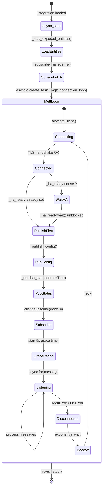
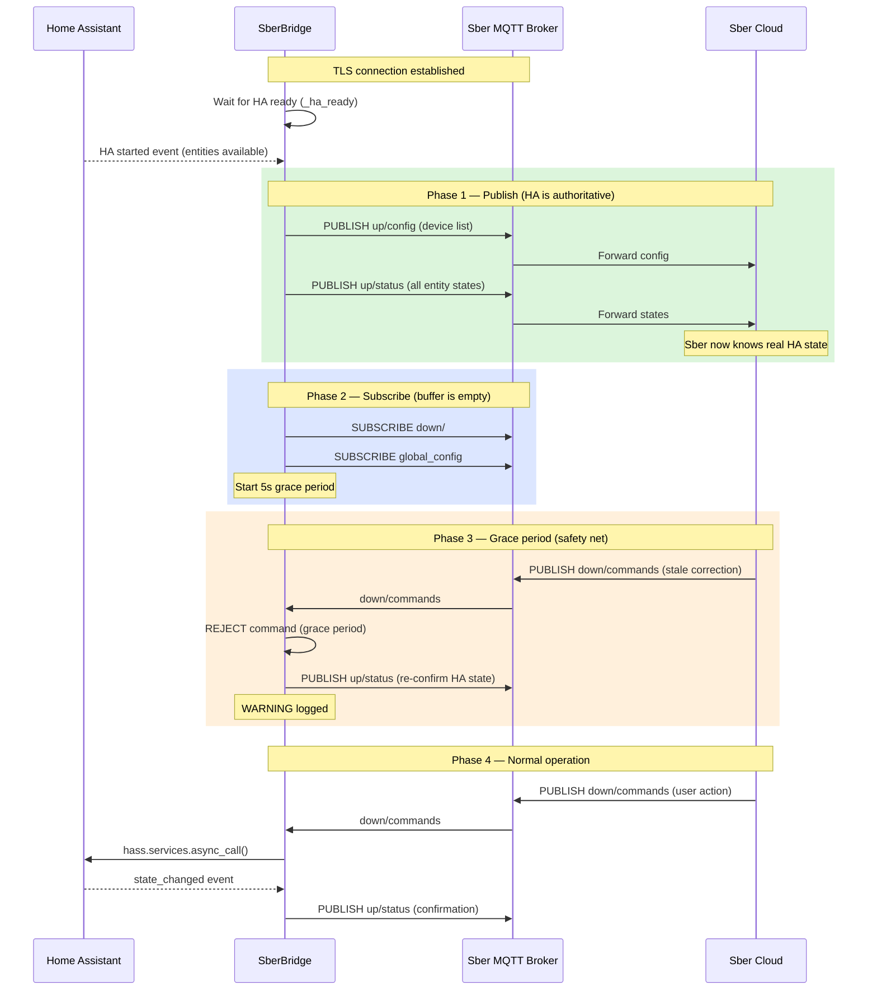
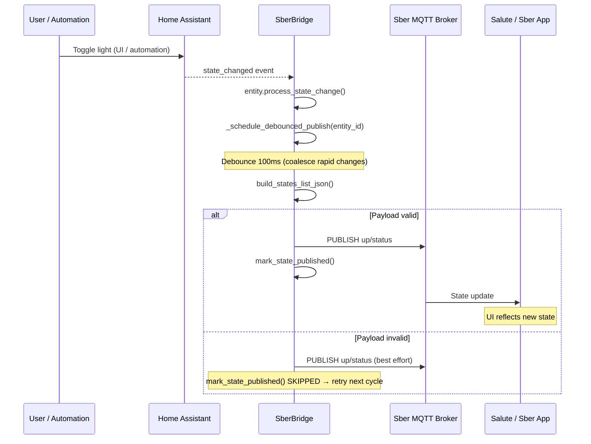
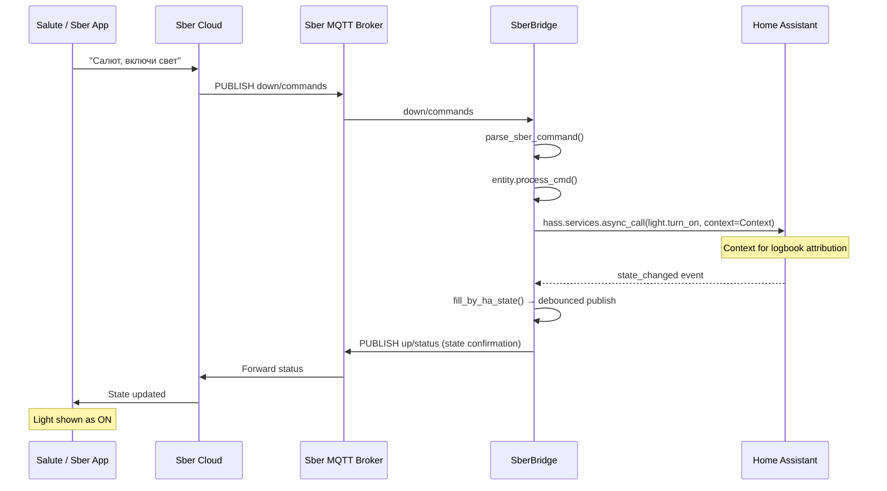
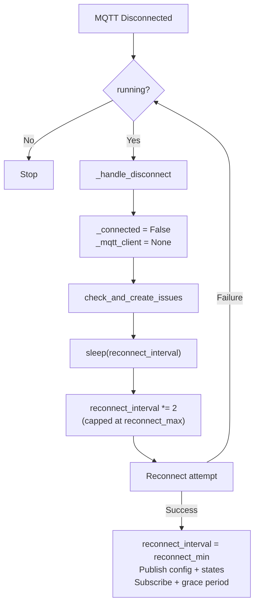
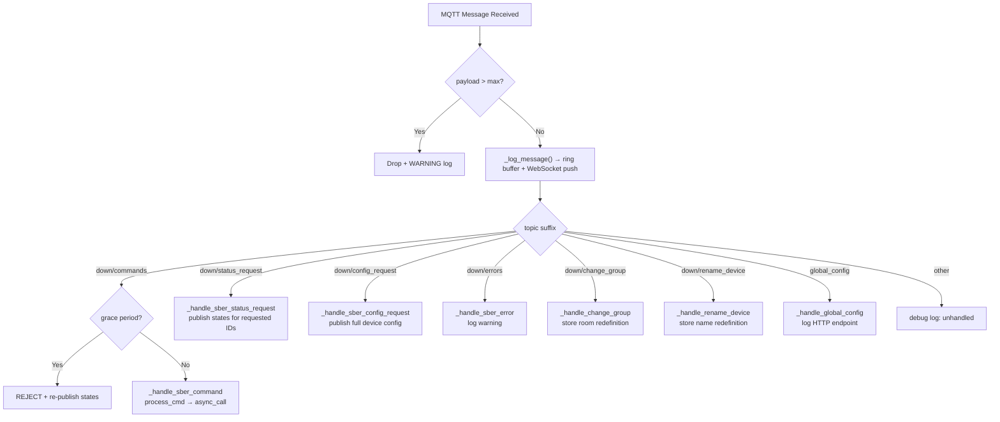
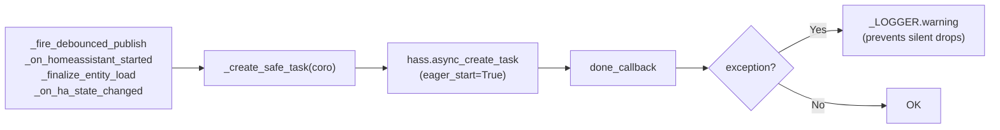

# MQTT Connection & Message Flow

## Connection Lifecycle

## (Re)connect Sequence — Publish Before Subscribe

## HA → Sber State Sync (Normal Operation)

## Sber → HA Command Flow (Normal Operation)

## Reconnect with Exponential Backoff

## Message Routing

## Background Task Safety (_create_safe_task)

