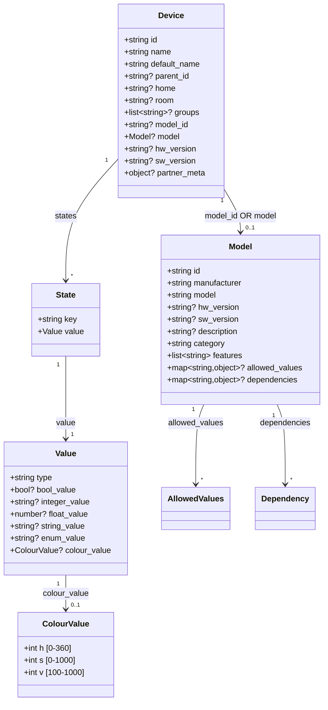

# Data Structures

Основные структуры данных Sber Smart Home C2C протокола.

## Обзор



---

## Device (устройство пользователя)

Описывает конкретное устройство, привязанное к пользователю.

| Поле | Тип | Обяз. | Описание |
|------|-----|:-----:|----------|
| `id` | string | **Да** | Уникальный ID устройства в системе вендора |
| `parent_id` | string | | ID родительского устройства (хаба) |
| `name` | string | **Да** | Имя, заданное пользователем |
| `default_name` | string | **Да** | Имя от производителя |
| `nicknames` | list\<string\> | | Алиасы устройства |
| `home` | string | | Группа помещений |
| `room` | string | | Помещение |
| `groups` | list\<string\> | | Группы устройств (только одного типа) |
| `model_id` | string | **Да*** | ID предопределённой модели |
| `model` | Model | **Да*** | Полное описание модели (inline) |
| `hw_version` | string | | Версия оборудования |
| `sw_version` | string | | Версия прошивки |
| `partner_meta` | object | | Произвольные метаданные (max **1024** символов JSON) |

!!! danger "model_id и model взаимоисключающие"
    Используется **строго одно** из двух:

    - `model_id` — ссылка на предопределённую модель (зарегистрированную через `POST /v1/models`)
    - `model` — полное inline-описание модели

    Передавать оба поля одновременно **запрещено**.

### Пример Device с model_id

```json
{
    "id": "ABCD_004",
    "name": "Мой терморегулятор",
    "default_name": "Умный терморегулятор",
    "home": "Мой дом",
    "room": "Гостиная",
    "groups": ["Климат", "Обогрев"],
    "model_id": "QWERTY124"
}
```

### Пример Device с inline model

```json
{
    "id": "ABCD_005",
    "name": "Ночник",
    "default_name": "Умная лампа",
    "home": "Мой дом",
    "room": "Спальня",
    "model": {
        "id": "LAMP_001",
        "manufacturer": "Xiaqara",
        "model": "SM1123456789",
        "category": "light",
        "features": ["online", "on_off", "light_brightness", "light_colour", "light_colour_temp", "light_mode"],
        "dependencies": {
            "light_colour": {
                "key": "light_mode",
                "value": [{"type": "ENUM", "enum_value": "colour"}]
            }
        },
        "allowed_values": {
            "light_brightness": {
                "type": "INTEGER",
                "integer_values": {"min": "100", "max": "900", "step": "1"}
            }
        }
    }
}
```

---

## Model (модель устройства)

Описывает тип (модель) устройства — его возможности и ограничения.

| Поле | Тип | Обяз. | Описание |
|------|-----|:-----:|----------|
| `id` | string | **Да** | Уникальный ID модели |
| `manufacturer` | string | **Да** | Производитель |
| `model` | string | **Да** | Название модели |
| `hw_version` | string | | Версия оборудования |
| `sw_version` | string | | Версия прошивки |
| `description` | string | | Описание |
| `category` | string | **Да** | Категория устройства (см. [Device Categories](device-categories.md)) |
| `features` | list\<string\> | **Да** | Список поддерживаемых функций (см. [Features](features.md)) |
| `allowed_values` | map\<string, AllowedValue\> | | Допустимые значения для функций |
| `dependencies` | map\<string, Dependency\> | | Зависимости между функциями |

### Пример Model

```json
{
    "id": "QWERTY124",
    "manufacturer": "Xiaqara",
    "model": "SM1123456789",
    "hw_version": "3.1",
    "sw_version": "5.6",
    "description": "Умная розетка Xiaqara",
    "category": "socket",
    "features": ["online", "on_off", "child_lock", "current", "power", "voltage"],
    "allowed_values": {
        "power": {
            "type": "INTEGER",
            "integer_values": {"min": "10", "max": "45000", "step": "1"}
        }
    }
}
```

---

## State (состояние функции)

Описывает текущее состояние одной функции устройства.

| Поле | Тип | Обяз. | Описание |
|------|-----|:-----:|----------|
| `key` | string | **Да** | Название функции (например, `on_off`, `temperature`) |
| `value` | Value | **Да** | Текущее значение функции |

### Пример массива states

```json
{
    "states": [
        {"key": "online", "value": {"type": "BOOL", "bool_value": true}},
        {"key": "on_off", "value": {"type": "BOOL", "bool_value": true}},
        {"key": "temperature", "value": {"type": "INTEGER", "integer_value": "220"}}
    ]
}
```

---

## Value (значение функции)

Полиморфный объект — тип определяется полем `type`, а конкретное значение лежит в одном из type-specific полей.

| Поле | Тип | Условие | Описание |
|------|-----|---------|----------|
| `type` | string | **Всегда** | `BOOL`, `INTEGER`, `FLOAT`, `STRING`, `ENUM`, `COLOUR` |
| `bool_value` | boolean | type=BOOL | Логическое значение |
| `integer_value` | **string** | type=INTEGER | Целое число **в виде строки** (!) |
| `float_value` | number | type=FLOAT | Вещественное число |
| `string_value` | string | type=STRING | Строковое значение |
| `enum_value` | string | type=ENUM | Перечисляемое значение |
| `colour_value` | ColourValue | type=COLOUR | HSV цвет |

!!! danger "integer_value — это STRING"
    В C2C API `integer_value` передаётся как **строка**, не как число:

    ```json
    {"type": "INTEGER", "integer_value": "220"}
    ```

    НЕ `"integer_value": 220`

    **Исключение:** в примерах MQTT DIY (`agent-connect`) встречается `"integer_value": 256` (число).
    Сбер, вероятно, принимает оба варианта, но C2C спецификация требует строку.

### Тип COLOUR — HSV

| Поле | Тип | Диапазон | Описание |
|------|-----|----------|----------|
| `h` | int | 0–360 | Hue (оттенок), градусы |
| `s` | int | 0–1000 | Saturation (насыщенность), промилле |
| `v` | int | 100–1000 | Value (яркость), промилле. **Минимум 100, не 0!** |

```json
{"type": "COLOUR", "colour_value": {"h": 360, "s": 1000, "v": 1000}}
```

### Сводная таблица типов

| type | Поле значения | Тип поля | Пример |
|------|--------------|----------|--------|
| BOOL | `bool_value` | boolean | `true` |
| INTEGER | `integer_value` | **string** | `"220"` |
| FLOAT | `float_value` | number | `22.5` |
| STRING | `string_value` | string | `"text"` |
| ENUM | `enum_value` | string | `"auto"` |
| COLOUR | `colour_value` | object | `{"h":360,"s":1000,"v":1000}` |

---

## allowed_values (допустимые значения)

Определяет ограничения на значения функций. Задаётся в объекте `Model.allowed_values`.

### INTEGER

```json
{
    "hvac_temp_set": {
        "type": "INTEGER",
        "integer_values": {
            "min": "25",
            "max": "40",
            "step": "5"
        }
    }
}
```

!!! note "min, max, step — строки"
    Все поля `integer_values` — **строки**, не числа.

### FLOAT

```json
{
    "hvac_water_level": {
        "type": "FLOAT",
        "float_values": {
            "min": 0.5,
            "max": 5
        }
    }
}
```

### ENUM

```json
{
    "hvac_air_flow_power": {
        "type": "ENUM",
        "enum_values": {
            "values": ["auto", "high", "low", "medium", "turbo"]
        }
    }
}
```

### COLOUR

```json
{
    "light_colour": {
        "type": "COLOUR"
    }
}
```

---

## dependencies (зависимости функций)

Определяет условия, при которых функция доступна. Задаётся в `Model.dependencies`.

**Семантика:** функция `dependent_feature` доступна **только** когда `controlling_feature` имеет одно из указанных значений.

### Структура

```json
{
    "dependencies": {
        "<dependent_feature>": {
            "key": "<controlling_feature>",
            "value": [
                {
                    "type": "<VALUE_TYPE>",
                    "<type>_value": "<value>"
                }
            ]
        }
    }
}
```

### Пример: light_colour зависит от light_mode

`light_colour` доступна только когда `light_mode` = `colour`:

```json
{
    "dependencies": {
        "light_colour": {
            "key": "light_mode",
            "value": [{"type": "ENUM", "enum_value": "colour"}]
        }
    }
}
```

---

## Error (ошибка устройства)

Используется для описания ошибки при обработке запроса для конкретного устройства.

| Поле | Тип | Обяз. | Описание |
|------|-----|:-----:|----------|
| `id` | string | **Да** | ID устройства |
| `code` | integer | **Да** | Код ошибки (400, 401, 403, 500, 503) |
| `message` | string | **Да** | Описание ошибки |

### Коды ошибок

| Код | Описание |
|-----|----------|
| 400 | Ошибка валидации запроса |
| 401 | Ошибка авторизации |
| 403 | Ошибка проверки токена |
| 500 | Внутренняя ошибка системы |
| 503 | Сервер недоступен |

```json
{
    "errors": [
        {
            "id": "ABCD_005",
            "code": 500,
            "message": "System error"
        }
    ]
}
```
