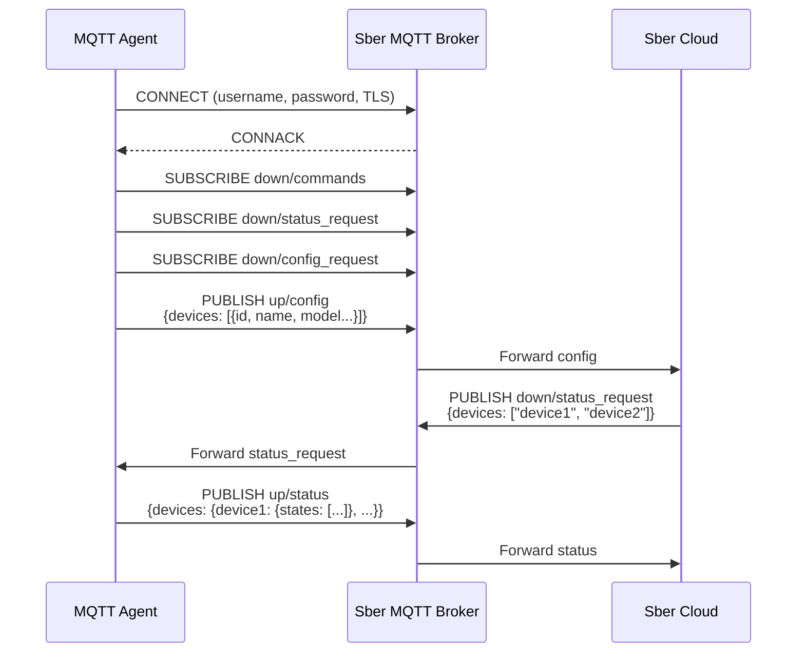
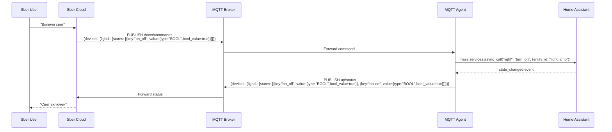
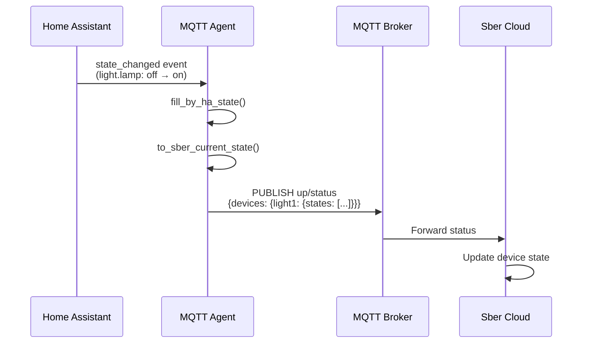

# MQTT Topics

## Подключение

| Параметр | Значение |
|----------|----------|
| Host | `mqtts://mqtt-partners.iot.sberdevices.ru` |
| Port | `8883` (TLS) |
| Username | Логин из Sber Developer Studio |
| Password | Пароль из Sber Developer Studio |

## Формат топиков

```
sberdevices/v1/<username>/<direction>/<topic>
```

- `<username>` — логин для MQTT-сервера
- `<direction>` — `up` (агент → облако) или `down` (облако → агент)

## Сводная таблица

| Топик | Направление | Описание |
|-------|:-----------:|----------|
| `up/config` | Agent → Cloud | Регистрация/обновление конфигурации устройств |
| `up/status` | Agent → Cloud | Обновление состояния устройств |
| `down/commands` | Cloud → Agent | Команды на изменение состояния |
| `down/status_request` | Cloud → Agent | Запрос текущего состояния |
| `down/config_request` | Cloud → Agent | Запрос конфигурации устройств |

---

## Uplink: Agent → Cloud

### up/config — Конфигурация устройств

Отправляет список устройств с их моделями в облако Sber. Публикуется:

- При подключении к MQTT брокеру
- При изменении списка устройств
- В ответ на `down/config_request`

**Payload:** массив объектов [Device](data-structures.md#device-устройство-пользователя)

```json
{
    "devices": [
        {
            "id": "ABCD_005",
            "name": "Ночник",
            "default_name": "Умная лампа",
            "home": "Мой дом",
            "room": "Спальня",
            "model": {
                "id": "LAMP_001",
                "manufacturer": "Xiaqara",
                "model": "SM1123456789",
                "category": "light",
                "features": ["online", "on_off", "light_brightness"]
            }
        }
    ]
}
```

!!! note "devices — массив"
    В `up/config` поле `devices` — это **массив** объектов (`list<Device>`).

---

### up/status — Обновление состояния

Отправляет текущее состояние устройств. Публикуется:

- При изменении состояния устройства
- В ответ на `down/status_request`
- После выполнения команды из `down/commands`

**Payload:** словарь `device_id` → `{states: [...]}`

```json
{
    "devices": {
        "ABCD_003": {
            "states": [
                {
                    "key": "online",
                    "value": {"type": "BOOL", "bool_value": true}
                },
                {
                    "key": "on_off",
                    "value": {"type": "BOOL", "bool_value": true}
                }
            ]
        },
        "ABCD_004": {
            "states": [
                {
                    "key": "online",
                    "value": {"type": "BOOL", "bool_value": true}
                },
                {
                    "key": "temperature",
                    "value": {"type": "INTEGER", "integer_value": "220"}
                }
            ]
        }
    }
}
```

!!! warning "devices — словарь, НЕ массив"
    В `up/status` поле `devices` — это **словарь** (`dict<string, {states}>>`).
    Ключ — `device_id`, значение — объект со `states`.

    Это **отличается** от `up/config`, где `devices` — массив.

---

## Downlink: Cloud → Agent

### down/commands — Команды изменения состояния

Облако отправляет команды на изменение состояния устройств. Агент должен:

1. Применить команду к устройству
2. Отправить актуальное состояние в `up/status`

**Payload:** словарь `device_id` → `{states: [...]}`

```json
{
    "devices": {
        "ABCD_003": {
            "states": [
                {
                    "key": "on_off",
                    "value": {"type": "BOOL", "bool_value": true}
                }
            ]
        }
    }
}
```

!!! note "Формат команды = формат состояния"
    Структура payload команды идентична `up/status`.
    Каждый state в команде содержит целевое значение функции.

---

### down/status_request — Запрос состояния

Облако запрашивает текущее состояние указанных устройств. Агент должен ответить публикацией в `up/status`.

**Payload:** массив `device_id`

```json
{
    "devices": ["ABCD_003", "ABCD_004"]
}
```

!!! note "devices — массив строк"
    Здесь `devices` — плоский массив ID устройств, не объектов.

---

### down/config_request — Запрос конфигурации

Облако запрашивает текущую конфигурацию устройств. Агент должен ответить публикацией в `up/config`.

**Payload:** пустой объект

```json
{}
```

---

## Sequence Diagrams

### Регистрация устройств (первое подключение)



### Цикл команды (Sber → Agent → подтверждение)



### Обновление состояния (HA → Sber)


